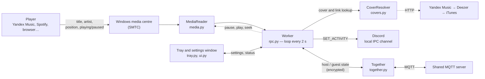

<div align="center">


# Music RPC

**English** · [Русский](README.md)

**Shows what you are listening to in Discord: track, artist, cover art and a progress bar.**

Works with Yandex Music, Spotify, VK Music, a web browser, or any other player that supports
the Windows media controls. Lives in the system tray, no account logins required.

<p align="center">
  
  &nbsp;&nbsp;&nbsp;
  
</p>

</div>

---

> **Note on the interface language.** The program's UI (tray menu, settings window, messages) is currently in **Russian**.
> This document gives the Russian labels together with their English meaning, like **Настройки** (Settings).
> Translations are welcome as contributions: all UI strings are in `ymrpc/ui.py`, `ymrpc/tray.py` and `ymrpc/status.py`.

## Table of contents

- [Features](#features)
- [What it looks like](#what-it-looks-like)
- [Requirements](#requirements)
- [Quick start](#quick-start)
- [Installing from the command line](#installing-from-the-command-line)
- [Usage](#usage)
- [Settings](#settings)
- [Listen together](#listen-together)
- [Autostart](#autostart)
- [Building an .exe](#building-an-exe)
- [How it works](#how-it-works)
- [Project structure](#project-structure)
- [Data, logs and privacy](#data-logs-and-privacy)
- [Troubleshooting](#troubleshooting)
- [Limitations](#limitations)
- [FAQ](#faq)
- [Development](#development)
- [Credits and disclaimer](#credits-and-disclaimer)
- [License](#license)

---

## Features

- **"Listening to …" status** in your Discord profile: track title, artist, album.
- **Album cover** found automatically (Yandex Music → Deezer → iTunes).
- **Progress bar** with current time and duration, reacts correctly to seeking.
- **A button with a link to the track** (visible to people who view your profile).
- **Any player**: the source is selected by application name, or leave it empty for "any playing player".
- **Runs in the background**: a tray icon that changes colour with the state, quick toggles in the menu, a settings window.
- **Start with Windows**, and the program waits for Discord to come up on its own.
- **Flexible text**: line templates such as `{artist} — {title}`.
- **Resilient**: reconnects to Discord if it restarts or is still loading; the status disappears on pause and on exit.
- **No accounts**: the track comes from the Windows media centre, not from a service API.
- **Listen together**: a friend (the host) starts broadcasting, and you (a guest) see and hear the same thing: the host's track in your Discord, and pause/seek mirrored in your player. Everything travels through a shared server and is encrypted with the room code.
- **"Don't show" filter**: tracks and artists containing your stop words never reach the status or "listen together".
- **Recent tracks** in the tray menu: open a track in the browser or copy its link.
- **One-click diagnostics**: shows what Windows sees and tests the connection to Discord and to the "listen together" servers.

## What it looks like

<p align="center">
  
</p>

This is how the status looks in a Discord profile:

- **"Listening to …"** — the application name from the Discord Developer Portal (you choose it yourself, see the [quick start](#quick-start));
- the **first line** is the track title (`{title}`), the **second** is the artist (`{artist}`);
- the **cover art** is on the left; the cover caption (`{album}`) appears as a tooltip when you hover over it;
- a **progress bar** with the current time and duration;
- a **button** with a link to the track (`show_button`). Other people can see it; you can't see it in your own profile.

The tray icon changes colour depending on the state:

| Colour | State |
|---|---|
| Purple | Playing, status is shown |
| Muted purple | Track is paused |
| Grey | Waiting for music / disabled |
| Red | Problem (hover the icon to see the reason): no Client ID, Discord not found or not responding |

## Requirements

| | |
|---|---|
| OS | **Windows 10 (1809+) or Windows 11.** The program uses the Windows media centre and the registry; it does not work on macOS or Linux |
| Python | **You don't need to install one, and the version doesn't matter.** `install.bat` uses a suitable installed one (3.10–3.14 with tkinter, 3.13 preferred), and if there is none (not installed at all, or only a too-new one such as 3.15) it downloads its own Python 3.13 into the `.tools` folder (about 50 MB) without touching your system Python. Not needed for the prebuilt `.exe`. If you run from source yourself, you need Python **3.9 or newer**; the code is covered by automated tests on 3.9, 3.10, 3.11, 3.12, 3.13, 3.14 and 3.15 (alpha) |
| Discord | The regular desktop app (not a browser tab), running with the same privileges as Music RPC |
| Internet | Only needed for cover-art and link lookups and for "listen together" |

Python dependencies (installed automatically, see [`requirements.txt`](requirements.txt)):
[`pypresence`](https://github.com/qwertyquerty/pypresence), [`pystray`](https://github.com/moses-palmer/pystray),
[`Pillow`](https://python-pillow.org/), [`paho-mqtt`](https://github.com/eclipse-paho/paho.mqtt.python) (only needed for "listen together"), and a set of `winrt-*` packages
([pywinrt](https://github.com/pywinrt/pywinrt)) for access to the Windows media centre.
Cover lookup is written with the Python standard library, so it doesn't depend on third-party packages.

## Quick start

### Step 1. Create an application in Discord

Discord shows a status on behalf of an "application", so you need to create one (free, takes a minute):

1. Open <https://discord.com/developers/applications> and click **New Application**.
2. Enter a name. **This is what your friends will see:** "Listening to *name*". For example, "Music".
3. Optionally upload an icon in **General Information** (a ready one is in [`assets/app.png`](assets/app.png)).
4. Copy the **Application ID** — a long number of 17–20 digits.
   You need exactly this, not the "Public Key".

### Step 2. Install the program

1. Download the repository (**Code → Download ZIP**) and unpack it into a **permanent** folder, for example `C:\Programs\MusicRPC`.
   Do not move it later if you enable autostart.
2. Run **`install.bat`**. It picks a Python by itself (see [Requirements](#requirements)), creates a virtual environment `.venv` and installs the dependencies (one time only). If no suitable Python exists, the script downloads its own, which needs access to GitHub.
3. Run **`start.bat`**. The icon appears in the tray (possibly under the hidden icons ⌃ next to the clock).
4. On the first launch the settings window opens: paste your **Client ID** and click **Сохранить** (Save).

### Step 3. Check Discord

In the Discord settings, showing your activity must be allowed
(the activity-privacy section; the exact name depends on the Discord version).

Play a track in your player, and within a couple of seconds the status appears in your profile. If it doesn't, see
[Troubleshooting](#troubleshooting).

### Updating from a previous version

1. Close the program: right-click the tray icon → **Выход** (Exit).
2. Replace the files in the folder with the new ones. Leave the `.venv` and `.tools` folders alone.
3. Run **`install.bat`** again: it quickly installs any missing packages (version 1.2 added `paho-mqtt`, and `requests` is no longer needed).
   Then run `start.bat`.

Your settings are kept: new parameters get their default values.

## Installing from the command line

For those who prefer a terminal:

```bat
git clone <repository URL from the Code button>
cd MusicRPC

:: manually you need Python 3.10–3.14 (3.13 recommended). It is easier to run install.bat: it finds or downloads Python itself.
:: If there is no suitable Python, uv can fetch one (https://docs.astral.sh/uv/): uv venv --python 3.13 --seed .venv
py -3.13 -m venv .venv
.venv\Scripts\python.exe -m pip install --upgrade pip
.venv\Scripts\python.exe -m pip install -r requirements.txt

:: run without a console window
start "" .venv\Scripts\pythonw.exe music_rpc.pyw

:: run with a console and verbose log (for debugging)
.venv\Scripts\python.exe music_rpc.pyw --debug
```

### Command-line flags

| Flag | What it does |
|---|---|
| `--diagnose` | Prints which players Windows sees, tests the connection to Discord and sends a test status for 6 seconds. `diagnose.bat` does the same |
| `--debug` | Verbose log (DEBUG level) |
| `--autostart` | Internal flag added by the autostart entry. The program waits for the desktop (see [Autostart](#autostart)) |

## Usage

### Tray menu (right-click)

| Item (Russian label) | Action |
|---|---|
| *(status line)* | What is going on right now: "Играет: …" (Playing), "Discord не найден…" (Discord not found), etc. |
| Показывать статус в Discord (Show status in Discord) | Master switch |
| Обложка (Cover) | Show the cover art |
| Полоса прогресса (Progress bar) | Show the progress bar / time |
| Кнопка со ссылкой на трек (Track link button) | Show the button |
| Показывать на паузе (Show when paused) | Keep the status while paused (a ⏸ mark is added) |
| Треки → (Tracks) | Submenu: open the current track in the browser, copy its link, and a list of the last 10 tracks (click: open the track or, if there is no link, copy its name). The list is kept in memory only |
| Слушать вместе → (Listen together) | Submenu: mode (off / host / guest), copy the room code, open the host's track. See [Listen together](#listen-together) |
| Автозапуск с Windows (Start with Windows) | Add to / remove from autostart |
| Настройки… (Settings…) | Settings window (double-clicking the icon does the same) |
| Открыть папку с логом (Open log folder) | Opens `%APPDATA%\MusicRPC` |
| Выход (Exit) | Closes the program and clears the status in Discord |

Toggles from the menu apply immediately and are saved.

### Settings window

<p align="center">
  
</p>

The window has three tabs: **Основное** (General), **Тексты и фильтр** (Texts and filter) and **Слушать вместе** (Listen together). It contains all the parameters from the [table below](#settings), plus these buttons:

- **Как получить?** (How do I get it?) — opens the Discord developer portal and shows instructions.
- **Проверить** (Check) — shows which sources Windows sees (application, artist, track, playing/paused).
  Use it to work out the value for the "Приложения" (Applications) field.

## Settings

Settings are stored in `%APPDATA%\MusicRPC\config.json`. The easiest way to change them is the settings window.

| Parameter | Default | Description |
|---|---|---|
| `client_id` | `""` | Application ID from the Discord Developer Portal. Without it the status does not work |
| `enabled` | `true` | Master switch |
| `app_filters` | `["yandex", "яндекс"]` | List of substrings: which players to take music from. Matched case-insensitively against the system application identifier. **An empty list means any playing player** |
| `show_cover` | `true` | Show the cover art |
| `show_progress` | `true` | Show the progress bar / timer |
| `show_button` | `true` | Show the track link button |
| `show_paused` | `false` | Show the status while paused. If off, the status is removed on pause |
| `button_label` | `"Открыть трек"` ("Open track") | Button caption (up to 32 characters) |
| `details_format` | `"{title}"` | First line |
| `state_format` | `"{artist}"` | Second line |
| `large_text_format` | `"{album}"` | Cover caption: shown as a tooltip when you hover over the cover |
| `status_display` | `"name"` | What to show in the server member list: `name` — the application name, `details` — the first line, `state` — the second line |
| `hide_keywords` | `[]` | Filter words. If any of them appears (case-insensitively) in the track title, artist, album or player name, the status is not shown and the track is kept out of "listen together". The icon turns grey with the tooltip "Скрыто вашим фильтром" (Hidden by your filter) |
| `together_mode` | `"off"` | "Listen together" mode: `off`, `host` — I broadcast, `guest` — I listen to a friend |
| `together_room` | `""` | Room code such as `ABCD-EFGH-JKLM` |
| `together_name` | `""` | Your name as friends see it (empty: "Хост" / "Гость", i.e. Host / Guest) |
| `together_broker` | `""` | MQTT server address. Empty: the public defaults. Your own: `mqtt://address:1883` or `mqtts://address:8883`, several may be comma-separated |
| `together_mirror` | `true` | Guest: show the host's track in your own Discord |
| `together_sync_player` | `true` | Guest: adjust your player (pause/play, seek) when the same track is playing |
| `together_auto_open` | `false` | Guest: open the host's track in the browser when you're playing a different one |
| `together_suffix` | `"· вместе с {name}"` | Addition to the guest's second status line; `{name}` is the host's name (the default means "together with …") |
| `poll_interval` | `2.0` | How often to poll the player, in seconds (1 to 10 allowed) |
| `autostart` | `false` | Start with Windows |
| `yandex_token` | `""` | Optional. A Yandex OAuth token for cover and link lookups. See [privacy](#data-logs-and-privacy) |

> **Important:** `config.json` is read once at startup. If you edit it by hand, close the program first
> (tray → Выход / Exit), otherwise it will overwrite the file with its own settings.

Example:

```json
{
  "client_id": "123456789012345678",
  "enabled": true,
  "app_filters": ["yandex", "spotify"],
  "show_cover": true,
  "show_progress": true,
  "show_button": true,
  "show_paused": false,
  "button_label": "Open track",
  "hide_keywords": [],
  "together_mode": "off",
  "together_room": "",
  "together_name": "",
  "together_broker": "",
  "together_mirror": true,
  "together_sync_player": true,
  "together_auto_open": false,
  "together_suffix": "· вместе с {name}",
  "details_format": "{artist} — {title}",
  "state_format": "{album}",
  "large_text_format": "{album}",
  "status_display": "name",
  "poll_interval": 2.0,
  "autostart": true,
  "yandex_token": ""
}
```

### Line templates

`details_format`, `state_format` and `large_text_format` support these placeholders:

| Placeholder | Replaced with |
|---|---|
| `{title}` | Track title |
| `{artist}` | Artist |
| `{album}` | Album |

Examples: `{artist} — {title}`, `🎵 {title}`, `{title} ({album})`.

Rules:

- An unknown placeholder is left in the text as is (so a typo is easy to spot).
- If part of the data is empty (for example, the track has no album), dangling separators at the edges are trimmed:
  `{artist} — {title}` without an artist gives just the title.
- Discord accepts strings of 2 to 128 characters: overly long ones are truncated with "…", single-character ones are padded with an invisible character.
- While paused (with `show_paused: true`), "⏸ " is added in front of the second line.

### Choosing the source (`app_filters`)

Windows knows every player by a system identifier (AppUserModelID). In the settings it is enough to give a **part**
of that identifier. To find out what it is for your player:

1. Start playing a track in the player.
2. Click **Проверить** (Check) in the settings (or run `diagnose.bat`).
3. Find your player in the list — the "Источник" (Source) line is its identifier.
4. Enter a part of it (for example, `spotify`) into the "Приложения" (Applications) field. Separate several players with commas.

If several sources are active at once, the one that is **playing** takes priority; if several are playing, the first one in Windows' list is used.

> Browsers report **any** playback to Windows: if you add a browser to the sources, the status may show not only music but, say, a video as well.

## Listen together

One person (the **host**) broadcasts what they're listening to, and the others (the **guests**) listen to the same thing. No new accounts and no servers of your own:
participants exchange short encrypted messages through a shared MQTT server (a public one by default).

> **What is synchronised and what isn't.** The *state* is synchronised: which track is playing, pause/play, position. The sound is not: each guest plays it in **their own** player
> with **their own** subscription. The program can't start the right track in someone else's player by itself, but it can open a link to it in the browser and, once the same track is
> playing on both sides, repeat the host's pause and seeking.

### How to use it

1. **Host**: tray → **Слушать вместе → Я транслирую (хост)** (Listen together → I broadcast (host)). The program creates a room code like `ABCD-EFGH-JKLM`
   and copies it to the clipboard. Send the code to your friends.
2. **Guests**: tray → **Слушать вместе → Я слушаю друга (гость)…** (I listen to a friend (guest)…), or the **Слушать вместе** tab in the settings.
   Paste the code, choose "guest" and click **Сохранить** (Save).
3. That's it. While the host listens to music, the guests see their track. The host sees in the menu how many people are listening along.
   To leave, choose "Выключено" (Off).

The host needs neither Discord nor a Client ID: broadcasting works independently of your Discord status.

### How to check that it works

You can check it yourself, without a friend and even without Discord:

1. **The "Проверить связь" (Check connection) button.** Settings → the **Слушать вместе** tab → the "Сервер" (Server) block → **Проверить связь** (up to 30 seconds).
   The program starts a "host" and a "guest" on your computer in a random room and passes a test track through the real server.
   It checks at once: whether `paho-mqtt` is installed, whether the server is reachable, whether encryption works, and whether a guest who joins later gets the track.
   The answer "✓ Слушать вместе должно работать" ("Listen together should work") means the network and encryption are fine.
2. **The line in the tray menu.** Tray → **Слушать вместе**: the state is written at the top. "подключаюсь…" (connecting…) means it is connecting,
   "Вы транслируете (комната …), слушают: 0" (You are broadcasting … listening: 0) means you're connected and waiting for guests, "нет связи с сервером" (no connection to the server) means the server is unreachable.
3. **`diagnose.bat`** does the same in the console (section 3) and shows which servers respond.
4. **A real test with another person.** The host turns on "host" mode and starts any track. The guest enters the code: the host's track appears in their Discord
   with the "· together with *name*" caption. If the guest has the same track open, the guest's player mirrors the host's pause and play.
   The host's tray menu shows the counter "слушают: 1" (listening: 1). In `app.log` both of you will have the line "Слушать вместе: подключились к …" (connected to …).

Items 1–3 check the connection but not the control of a specific player: you can only see that in item 4.

### What the guest does

| Setting | Default | What happens |
|---|---|---|
| Show the host's track in my Discord (`together_mirror`) | on | The host's track appears in your profile: cover, time, button. "· together with *name*" is appended to the second line. Works even if nothing is playing on your side. If the host pauses, the status behaves like it does when you pause |
| Adjust my player (`together_sync_player`) | on | **If the same track is playing on your side**: when the host pauses or plays, your player does the same; if positions drift apart by more than 3 seconds, your player seeks. If you pause it yourself, the program doesn't argue until the host toggles something. Players aren't obliged to accept commands: if yours refuses (for instance, it can't seek), the program stops trying until the track changes |
| Open the host's track in the browser (`together_auto_open`) | off | When you're playing a **different** track, the host's track page in Yandex Music opens in the browser (once per track). Press "play" there |

You can also open the host's track manually without auto-open: tray → **Слушать вместе → Открыть трек хоста** (Open the host's track).

### How it works and how safe it is

- **Room = code.** The code yields (via PBKDF2-HMAC-SHA256, 100,000 iterations) the channel name on the server and the encryption keys.
  The code has 12 characters out of 32 possible, which is 60 bits: brute-forcing it is unrealistic.
- **Messages are encrypted and signed** (a counter mode on HMAC-SHA256 plus an HMAC-SHA256 tag, encrypt-then-MAC).
  A public server sees only ciphertext and your IP address; a message can't be forged or read without the code.
  This protects against casual observers on a public server; it is not a replacement for audited cryptography if you have something truly secret.
- **Whoever knows the code is in the room.** Send it only to friends. To "change the lock", press **Новый код** (New code) as the host.
- **Links from the host are accepted only from Yandex sites** (the ones the program creates); everything else is discarded.
  The cover may come from any site; it's just an image.
- The server remembers the host's messages, so a guest who joins later sees the current track immediately. When the host quits the program, that record is cleared;
  if the host's internet drops or the computer crashes, the server itself informs the guests (the MQTT "last will").
- There should be **one host** per room: if a second one appears, the guests keep following the first.

### Servers

By default the public MQTT brokers `broker.hivemq.com` and `broker.emqx.io` (port 1883) are used. If one is unavailable, the program switches to the other.
You can check their availability with `diagnose.bat` (section 3).

Public servers are free and come with no guarantees. If they are blocked or you want full independence, run your own broker (any MQTT 3.1.1 broker will do,
for example [Mosquitto](https://mosquitto.org/)) and enter its address on the **Слушать вместе → Сервер** (Listen together → Server) field:
`mqtt://address:1883` or `mqtts://address:8883`. Everyone in the room must use the same address.

## Autostart

Enable it with the checkbox in the settings or with the tray menu item.

**How it works:**

- The program adds a `MusicRPC` value to the registry key `HKEY_CURRENT_USER\Software\Microsoft\Windows\CurrentVersion\Run`
  (no administrator rights needed).
- The autostart command includes the `--autostart` flag:
  - from source: `"…\.venv\Scripts\pythonw.exe" "…\music_rpc.pyw" --autostart`
  - from the built `.exe`: `"…\MusicRPC.exe" --autostart`
- When it receives this flag, the program **waits for the taskbar to appear** (up to 90 seconds) plus 5 more seconds, so that Discord and the network come up.
- While Discord is starting, the program keeps retrying the connection, so the status appears 10–20 seconds after you sign in to Windows.
- If autostart is enabled, every manual launch refreshes the path in the registry, so moving the folder is "fixed" by one launch.
- Autostart entries from old versions (`YandexMusicRPC`) are removed automatically.

**If nothing shows up after a reboot:**

1. `Ctrl+Shift+Esc` → the **Startup** tab: the entry should be "Enabled".
2. Open `%APPDATA%\MusicRPC\app.log`. A line "Запуск при входе в Windows" ("Started at Windows sign-in") with the boot time means the program started.
   If there is no such line, check `crash.log` in the same folder.
3. Do not move the program folder after enabling autostart.

To disable: clear the checkbox in the settings. The registry entry is removed.

## Building an .exe

Optional. The ready `.exe` can be put anywhere, no Python needed alongside it.

1. Run `install.bat` (if you haven't already).
2. Run **`build_exe.bat`**. The script installs PyInstaller and builds a single file `dist\MusicRPC.exe` with no console window and the `assets\app.ico` icon.

If the file still shows an old icon, that is the Windows icon cache: rename the file or restart Explorer.
Autostart from the `.exe` works the same way as from source.

## How it works

### Overview



### Data source: the Windows media centre

When a player plays music, it tells Windows the track title, artist, album, position and state
(the data shown in the volume flyout and on the lock screen). The program reads it through the
`GlobalSystemMediaTransportControlsSessionManager` API (the `winrt-*` packages):

1. Gets the list of all "sessions" — players currently registered in the system.
2. Keeps those whose application identifier contains a substring from `app_filters`.
3. From those, picks the one that is playing (otherwise the first one).
4. Reads the title, artist, album, status and the "timeline" (start, end, position, last-updated time).
5. **Computes the current position**: Windows records the position at the moment `last_updated_time`, so the program adds
   the time elapsed since then. This keeps the progress bar accurate even if the player updates the position rarely.

If the player reports neither a position nor a duration, the program counts time itself from the moment it first saw the track
(Discord then shows an "elapsed" timer instead of a progress bar).

### Covers and links

Discord can only display an image by URL, while Windows provides the cover only as a data stream. So the cover is
**looked up by title and artist** in public catalogues (no account login), in this order:

1. **Yandex Music** (`api.music.yandex.net/search`) — a 400×400 cover and a link to the track.
2. **Deezer** (`api.deezer.com/search`) — cover only.
3. **iTunes** (`itunes.apple.com/search`) — a 600×600 cover only.

How it is verified that the right track was found: titles are compared ignoring case and punctuation
(containment or 80% similarity is accepted), and the artist must match at least partially.
The first six results are checked. This way "Song" won't be replaced by someone else's song with a similar name.

Technical details:

- The lookup runs in a separate thread and doesn't block the program. The first display of a track waits for the cover for at most **4 seconds**;
  if it isn't ready, the status is shown without it and the cover is picked up on a later step.
- Results are cached (up to 300 tracks). A failed lookup is retried no more often than once every 2 minutes.
- The request timeout is 6 seconds; any network error simply means "no cover".
- The track link looks like `https://music.yandex.ru/album/<album>/track/<track>` and exists only if the track was found in Yandex Music.

### The Discord status

The program talks to Discord through a **local IPC channel** (the `discord-ipc-N` named pipe on Windows) using
[`pypresence`](https://github.com/qwertyquerty/pypresence) — the same way games and other applications do. Your password, Discord token
and messages are neither accessible to the program nor needed.

What is sent:

| Status field | Value |
|---|---|
| Activity type | "Listening" |
| `details` / `state` | The first and second lines from the templates |
| `large_image` / `large_text` | The cover (URL) and its hover tooltip |
| `start` / `end` | Track start and end time — Discord draws the progress bar from them |
| `buttons` | One button with a link to the track |
| `status_display_type` | What to show in the member list (if something other than the application name is selected) |

**When the status is updated.** Discord limits the update rate (about 5 per 20 seconds), so the program
sends nothing unnecessary. The status is resent when:

- the track, the state (playing/paused) or the cover has changed;
- the track was **seeked**: the expected start time has drifted by more than 4 seconds (but no more than once every 5 seconds);
- at least 2 seconds have passed since the last update.

Pause removes the status entirely (or shows it with a ⏸ mark and no progress bar if `show_paused` is on).
Closing the player or exiting the program also clears the status.

**If Discord rejects the status** (for example, because of the image or the button), a simplified version is sent:
only the type, two lines and the time. That way the status doesn't vanish over a small detail.

### Connecting to Discord

This is where the nastiest pitfalls were, so the connection logic is careful:

- Discord creates up to 10 channels (`discord-ipc-0` … `discord-ipc-9`). The program **tries all of them** and takes the first live one.
- Right after Windows starts, Discord creates the channel before it begins answering on it. In that case the library waits
  forever, so the connection has an **8-second timeout**.
- No connection → retry every 10 seconds. Discord restarted in the middle of a track → the program reconnects by itself.
- Wrong Client ID → retry after 30 seconds, or immediately if you fix the ID in the settings.
- The reason for a failure is written to the log once, not every 10 seconds, and is reflected in the icon colour and tooltip.

### Listen together: messages and synchronisation

All participants of a room use two channels (topics) on the MQTT server: `…/host` (the host writes, the guests read) and `…/guest`
(the guests write, the host reads). The content of every message is encrypted.

| Message | From | When |
|---|---|---|
| `state` (track, position, playing/paused, cover and track links) | the host, flagged "retain" | on track change, pause, seek (position drifted by 3+ seconds) and every 10 seconds as a heartbeat |
| `hello` (name) | a guest | on connect and every 20 seconds |
| empty message | the server ("last will") or the host on exit | the host has gone |

Guest rules: the host's state is considered stale if it hasn't been refreshed for 35 seconds; messages whose timestamp differs from local time
by more than 10 minutes are discarded (protection against replays and wrong clocks).

The host's position is recomputed locally on the guest's side (the position in the message plus the time since it arrived), so the progress bar
moves smoothly instead of jumping every 10 seconds.

The guest's player synchronisation (`plan_sync` in `together.py`) controls the player through the same Windows media centre (the `play`, `pause` and `seek`
commands), and only if the **same** track is playing on the guest's side (title and artist are compared ignoring case and minor differences).
Pause and play are repeated on the host's events rather than continuously; seeking happens when positions differ by more than 3 seconds, no more than once every
8 seconds; there are at least 4 seconds between any two commands.

### Threads and states

| Thread | What it does |
|---|---|
| Main | Tkinter: a hidden window + the settings window. Every 150 ms it checks the command queue coming from the tray |
| Tray | `pystray`: icon, menu, tooltip |
| Worker | The `Worker` `asyncio` loop: polling SMTC, cover lookups (via `asyncio.to_thread`), talking to Discord |

Threads communicate through a thread-safe settings store (`ConfigStore`), a state "board" (`Status`) and a command queue.

States (`status.py`): `starting`, `disabled`, `no_client_id`, `bad_client_id`, `waiting`, `paused`, `playing`,
`discord_missing`, `discord_error`, `error`. The icon colour and tooltip text depend on the state.

A second copy cannot be started: the program takes the Windows mutex `Local\MusicRPC_singleton`.

## Project structure

```
.
├── music_rpc.pyw          # entry point (no console); writes crash.log on failure
├── requirements.txt       # Python dependencies
├── install.bat            # creates .venv and installs dependencies
├── start.bat              # launch without a console window
├── diagnose.bat           # diagnostics: music sources + Discord connection
├── build_exe.bat          # optional MusicRPC.exe build (PyInstaller)
├── assets/
│   ├── app.png            # icon (can be uploaded as the application icon in Discord)
│   └── app.ico            # icon for the .exe
├── tests/                 # automated tests (python -m unittest discover -s tests -t .)
├── docs/
│   ├── discord-profile.png # screenshot of the full Discord profile
│   ├── discord-status.png  # close-up of the status card
│   └── settings.png        # screenshot of the settings window
└── ymrpc/
    ├── __init__.py        # version, DISPLAY_NAME (name in tray and windows), APP_NAME
    ├── app.py             # startup, logging, mutex, --diagnose, main Tk loop
    ├── config.py          # Config, ConfigStore, data folder, migration of old settings
    ├── media.py           # SMTC reading: Track, MediaReader, position calculation
    ├── covers.py          # cover and link lookup: Yandex / Deezer / iTunes, cache (standard library only)
    ├── textmatch.py       # comparing titles and artists (for covers and "listen together")
    ├── together.py        # "listen together": room codes, encryption, MQTT, host/guest, synchronisation
    ├── history.py         # recent tracks for the tray menu
    ├── rpc.py             # status building (templates) and Worker: connection, updates
    ├── status.py          # program states, icon texts and colours
    ├── tray.py            # tray icon and menu (pystray)
    ├── ui.py              # settings window (tkinter)
    ├── icon.py            # code-drawn icon (Pillow); python -m ymrpc.icon regenerates assets
    └── autostart.py       # registry autostart and waiting for the desktop
```

## Data, logs and privacy

### Where things are stored

The `%APPDATA%\MusicRPC` folder (to open it quickly: tray → **Открыть папку с логом** / Open log folder):

| File | Purpose |
|---|---|
| `config.json` | Settings |
| `app.log` | Run log (up to 512 KB, 2 older copies are kept) |
| `crash.log` | An unhandled error that prevented the program from starting (written by `music_rpc.pyw`) |

Settings from earlier versions (`%APPDATA%\YandexMusicRPC`) are picked up automatically on the first launch.

### What is sent where

- **To Discord** (via the local Discord app): title, artist, album, a link to the cover and to the track, timing.
  Exactly what is shown in the status.
- **To Yandex Music, Deezer and iTunes**: a search query "artist title" and the usual technical data of an HTTP request.
  Only for the cover lookup; if you turn off both the cover and the button, no requests are made.
- **Only while "listen together" is on: to the MQTT server**, encrypted messages (track, position, name, links) go out and your IP address is visible.
  Only someone who knows the room code can decrypt them. The host also looks up the cover and the track link in order to share them with the guests,
  even if the host has turned off the cover and the button.
- **Nowhere else.** No analytics, no telemetry, no accounts.

`yandex_token` (optional) is stored in `config.json` **as plain text**. Enter it only if you understand
why you need it, and never publish that file.

## Troubleshooting

The first thing to do for any problem: **close the program in the tray and run `diagnose.bat`**.
It does three things:

1. Shows which players Windows sees (source identifier, track, position).
2. Tests the connection to Discord and sends a **test status for 6 seconds**. If it shows up in your profile, the connection is fine.
3. Checks the "listen together" servers: whether they are reachable and whether a test track gets through from a "host" to a "guest" (see [How to check that it works](#how-to-check-that-it-works)).

| Symptom | Likely cause and fix |
|---|---|
| `install.bat` prints `Microsoft Visual C++ 14.0 or greater is required` or `Failed building wheel for winrt-…` | That is how the old `install.bat` behaved with Python 3.15 and newer: there are no prebuilt `winrt-*` packages for it, so pip tries to build them from source. Get the current version of the project, **delete the `.venv` folder** (it is left over from the failed install) and run `install.bat` again. You do not need to install Visual C++ Build Tools |
| `install.bat`: "Не удалось скачать Python автоматически" (could not download Python automatically) | GitHub, where `uv` and Python are downloaded from, is unreachable (no internet, or a VPN, antivirus or proxy is blocking it). Check the connection, or install Python 3.13 from [python.org](https://www.python.org/downloads/windows/) manually and run `install.bat` again |
| Red icon: "Укажите Client ID" (Enter a Client ID) | The Client ID is empty. Settings → paste the **Application ID** |
| "Неверный Client ID" (Invalid Client ID) | Discord doesn't know such an application. Copy the **Application ID**, not the "Public Key" |
| "Discord не найден" (Discord not found) | Discord isn't running, is running in a browser tab, or is running with different privileges (for example, only one of them "as administrator"). Restart Discord and Music RPC as a normal user |
| "Discord не отвечает" (Discord not responding) | Discord is still starting (normal in the first seconds after Windows sign-in; the program reconnects by itself) or the channel is busy. Details are in `app.log`. A full Discord restart helps |
| Grey icon while music is playing | Windows doesn't see the player, or it doesn't match `app_filters`. Settings → **Проверить** (Check), and enter a part of the player's name in "Приложения" (Applications) |
| The player isn't in the list at all | The player doesn't report playback to Windows. In Yandex Music, for example, turning off crossfade ("smooth transition between tracks") helps |
| A status but no cover | The track wasn't found in the catalogues, or there is no network. Normal for rare tracks. Try later; the failure cache lives for 2 minutes |
| I can't see the button in my own profile | That's how Discord works: only other people see buttons |
| The progress bar jumps or is inaccurate | The player reports its position poorly. Turn off the progress bar for a plain status |
| A YouTube video shows up in the status | A browser is in `app_filters`. Leave only the player you need |
| "Слушать вместе: нет связи с сервером" (No connection to the server) | The public MQTT servers are unreachable (your ISP or firewall blocks port 1883, or the server is temporarily down). `diagnose.bat` shows which servers respond. Try a VPN or set your own server (`mqtts://…:8883`) |
| "Слушать вместе: жду хоста…" (Waiting for the host…) | The host isn't running, nothing is playing on their side, the code was entered wrongly, or the computers' clocks differ by more than 10 minutes |
| The guest's player doesn't seek | Not every player lets others control its position. Pause and play work more often. `app.log` will contain "плеер отказал" (the player refused) |
| The guest's player doesn't react at all | Synchronisation works only when the **same** track is playing on your side. If the title or artist differ (another version of the track), no commands are sent. Open the track from the host's link |
| Grey icon, tooltip "Скрыто вашим фильтром" (Hidden by your filter) | The track matched a word from the "Не показывать" (Don't show) filter on the "Тексты и фильтр" tab |
| Autostart didn't work | See the [Autostart](#autostart) section |
| Nothing helps | Include the last 30 lines of `app.log` and the output of `diagnose.bat` when reporting an issue |

## Limitations

- **Windows 10 (1809+) / 11 only.** The data source (SMTC) and autostart (registry) are Windows-specific.
- Data quality depends on the player: some don't report position, duration or album.
- **One** track is shown at a time.
- Works only with the **desktop** Discord. Discord in a browser tab doesn't accept a status from local programs.
- The button in the status is visible to others but not to you (a Discord peculiarity).
- The track link leads to Yandex Music and exists only if the track was found there.
- The name in the "Listening to …" label is set in the Discord Developer Portal and can't be changed from the program.
- "Listen together" synchronises the state, not the sound: everyone has their own player and subscription. Seeking depends on whether the player allows it.
- Public MQTT servers are free and come with no guarantees. Use your own server for full independence.

## FAQ

**Do I need to give the program my Yandex, Spotify or Discord login and password?**
No. The track is taken from the Windows media centre, and the program talks to Discord through a local channel.

**Does it work with Spotify, VK Music and other players?**
Yes, with any player that appears in the Windows media centre. Find it with the **Проверить** (Check) button and enter part of its name in "Приложения" (Applications).

**Does it work in a browser (Yandex Music, YouTube Music, etc.)?**
Yes, if you add the browser to the sources. But then things other than music may end up in the status: a browser reports any playback.

**How do I change the "Listening to …" label?**
Rename the application in the Discord Developer Portal.

**How do I check that "listen together" works if my friend isn't around?**
Settings → **Слушать вместе** → **Проверить связь**: the program plays both the host and the guest and passes a test track through the server. More: [How to check that it works](#how-to-check-that-it-works).

**Do I need a server of my own for "listen together"?**
No. Public MQTT servers are used by default, and messages are encrypted with the room code. You only need your own server if the public ones are blocked.

**My friend listens to Spotify and I use Yandex Music. Will it work?**
You'll see the host's status either way. Controlling your player works only if the same track is playing on your side (by title and artist).
The link the program opens leads to Yandex Music and exists only if the track was found there.

**Does the host see what I'm listening to?**
The host sees how many people are listening along, and their names. What plays on a guest's side, or whether anything plays at all, the host doesn't learn.

**How do I hide a track I'd rather not show?**
Add a word from its title or artist on the "Тексты и фильтр" tab → "Не показывать". Such a track reaches neither Discord nor "listen together".

**How do I change the name and icon of the program itself?**
The name is the `DISPLAY_NAME` constant in `ymrpc/__init__.py`. The icon is drawn by `ymrpc/icon.py`; running `python -m ymrpc.icon`
regenerates `assets/app.png` and `assets/app.ico`.

**Why doesn't the status appear instantly?**
The program polls the player every 2 seconds (configurable), and Discord limits the update rate.
Also, the first display of a track waits up to 4 seconds for the cover.

**Can I run it on Linux or macOS?**
No, but the code is layered: reading the player (`media.py`) and sending the status (`rpc.py`) are independent of each other,
so an alternative source can be written (for example, via MPRIS for Linux).

**How do I uninstall it?**
Exit the program (tray → Выход / Exit), clear the autostart checkbox, then delete the program folder (including `.venv` and `.tools`, if present) and, if you wish,
`%APPDATA%\MusicRPC`.

## Development

```bat
:: environment
py -3.13 -m venv .venv
.venv\Scripts\python.exe -m pip install -r requirements.txt

:: run with a console and DEBUG log
.venv\Scripts\python.exe music_rpc.pyw --debug

:: diagnostics
.venv\Scripts\python.exe music_rpc.pyw --diagnose

:: regenerate icons
.venv\Scripts\python.exe -m ymrpc.icon

:: automated tests (no Windows or Discord needed)
.venv\Scripts\python.exe -m unittest discover -s tests -t .
```

### Automated tests

The [`tests/`](tests) folder holds about 80 tests. They need no Windows, Discord or internet: the Windows media centre, Discord and the MQTT server are replaced by
fakes (`tests/helpers.py`). If the system has what's needed, integration tests also run:

- with the **real** `pypresence` library against a fake Discord (a unix socket; skipped on Windows);
- with a **real** [Mosquitto](https://mosquitto.org/) MQTT server (if `mosquitto` is on `PATH`);
- the settings window and the tray menu (need a display; on Linux use `xvfb-run`).

The suite passes on Python 3.9, 3.10, 3.11, 3.12, 3.13, 3.14 and 3.15 (alpha), and with both `paho-mqtt` 1.x and 2.x.

Good to know:

- `Worker` in `rpc.py` accepts `reader`, `resolver`, `rpc_factory`, `clock`, `together` and `history` through its constructor, so it is easy to test
  with fake objects, without Windows or Discord.
- Building the status from a track and the settings (`build_activity`) is a pure function with no side effects.
- Don't call `AioPresence.close()` from `pypresence` inside a running loop: it closes the event loop. The project
  closes the channel through `_hard_close`.
- Interval values (the pause between updates, the connection timeout, the number of channels, etc.) are constants at the top of `rpc.py`.

Ideas for further development: several settings profiles, choosing the source from the tray menu, per-player templates, support for other operating systems,
UI translations.

## Credits and disclaimer

- [pypresence](https://github.com/qwertyquerty/pypresence) — Discord Rich Presence.
- [pystray](https://github.com/moses-palmer/pystray) — the tray icon.
- [pywinrt](https://github.com/pywinrt/pywinrt) — access to the Windows media centre from Python.
- [paho-mqtt](https://github.com/eclipse-paho/paho.mqtt.python) — the MQTT client for "listen together".
- [Pillow](https://python-pillow.org/).

This project is **unofficial** and is not affiliated with Discord Inc., Yandex, Spotify, Deezer, Apple, HiveMQ or EMQ Technologies.
All names and trademarks belong to their respective owners and are mentioned only to describe compatibility.

## License

This project is licensed under the [MIT License](LICENSE): you are free to use, modify and distribute it,
provided the copyright notice is preserved.
