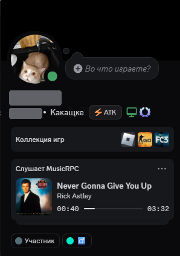
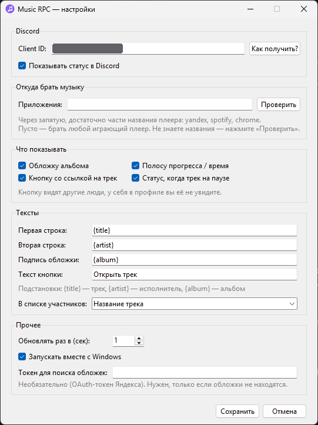
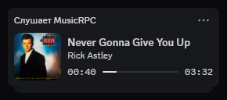
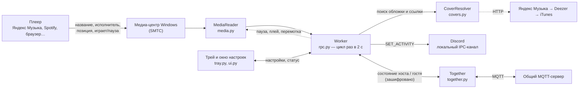

<div align="center">


# Music RPC

[English](README.en.md) · **Русский**

**Показывает в Discord, что вы слушаете: трек, исполнитель, обложка и полоса прогресса.**

Работает с Яндекс Музыкой, Spotify, VK Музыкой, браузером и любым другим плеером,
который умеет «медиа-кнопки» Windows. Живёт в системном трее, входить в аккаунты не нужно.

<p align="center">
  
  &nbsp;&nbsp;&nbsp;
  
</p>

</div>

---

## Содержание

- [Возможности](#возможности)
- [Как это выглядит](#как-это-выглядит)
- [Требования](#требования)
- [Быстрый старт](#быстрый-старт)
- [Установка из командной строки](#установка-из-командной-строки)
- [Использование](#использование)
- [Настройки](#настройки)
- [Слушать вместе](#слушать-вместе)
- [Автозапуск](#автозапуск)
- [Сборка в .exe](#сборка-в-exe)
- [Как это работает](#как-это-работает)
- [Структура проекта](#структура-проекта)
- [Данные, логи и приватность](#данные-логи-и-приватность)
- [Диагностика и частые проблемы](#диагностика-и-частые-проблемы)
- [Ограничения](#ограничения)
- [Вопросы и ответы](#вопросы-и-ответы)
- [Разработка](#разработка)
- [Благодарности и оговорка](#благодарности-и-оговорка)
- [Лицензия](#лицензия)

---

## Возможности

- **Статус «Слушает …»** в профиле Discord: название трека, исполнитель, альбом.
- **Обложка альбома** — подбирается автоматически (Яндекс Музыка → Deezer → iTunes).
- **Полоса прогресса** с текущим временем и длительностью, корректно реагирует на перемотку.
- **Кнопка со ссылкой на трек** (для тех, кто смотрит ваш профиль).
- **Любой плеер**: источник выбирается по названию приложения, можно оставить «любой играющий».
- **Работает в фоне**: иконка в трее с цветом состояния, быстрые переключатели в меню, окно настроек.
- **Автозапуск с Windows**, при котором программа сама дожидается Discord.
- **Гибкие тексты**: шаблоны строк вида `{artist} — {title}`.
- **Устойчивость**: переподключение к Discord, если он перезапущен или ещё загружается; статус исчезает на паузе и при выходе.
- **Никаких аккаунтов**: трек берётся из системного медиа-центра Windows, а не из API сервиса.
- **Слушать вместе**: друг (хост) включает трансляцию, вы (гость) видите и слышите то же самое: трек хоста в вашем Discord, синхронная пауза и перемотка вашего плеера. Обмен идёт через общий сервер и зашифрован кодом комнаты.
- **Фильтр «не показывать»**: треки и исполнители со стоп-словами не попадают ни в статус, ни в «слушать вместе».
- **Недавние треки** в меню трея: открыть трек в браузере или скопировать ссылку.
- **Диагностика в один клик**: показывает, что видит Windows, проверяет связь с Discord и с серверами «слушать вместе».

## Как это выглядит

<p align="center">
  
</p>

Так статус выглядит в профиле Discord:

- **«Слушает …»** — название приложения из Discord Developer Portal (вы задаёте его сами, см. [быстрый старт](#быстрый-старт));
- **первая строка** — название трека (`{title}`), **вторая** — исполнитель (`{artist}`);
- **обложка** слева; подпись обложки (`{album}`) показывается во всплывающей подсказке, если навести на неё курсор;
- **полоса прогресса** с текущим временем и длительностью;
- **кнопка** со ссылкой на трек (`show_button`). Её видят другие люди, у себя в профиле вы её не увидите.

Иконка в трее меняет цвет в зависимости от состояния:

| Цвет | Состояние |
|---|---|
| Фиолетовая | Играет, статус показан |
| Приглушённая | Трек на паузе |
| Серая | Ждёт музыку / выключено |
| Красная | Проблема (наведите курсор — там причина): нет Client ID, Discord не найден или не отвечает |

## Требования

| | |
|---|---|
| ОС | **Windows 10 (1809+) или Windows 11.** Программа использует системный медиа-центр Windows и реестр, на macOS и Linux не работает |
| Python | **Ставить отдельно не обязательно, версия не важна.** `install.bat` использует подходящий из установленных (3.10–3.14 с tkinter, лучше 3.13), а если такого нет (не стоит вообще или стоит слишком новый, например 3.15) — сам скачает свой Python 3.13 в папку `.tools` (около 50 МБ), системный Python не затрагивается. Для готового `.exe` Python не нужен. Если запускаете из исходников сами: нужен Python **3.9 или новее**. Код проверен автотестами на 3.9, 3.10, 3.11, 3.12, 3.13, 3.14 и 3.15 (alpha) |
| Discord | Обычное приложение для компьютера (не вкладка браузера). Запущено с теми же правами, что и Music RPC |
| Интернет | Нужен только для поиска обложек и ссылок и для «слушать вместе» |

Зависимости Python (ставятся автоматически, см. [`requirements.txt`](requirements.txt)):
[`pypresence`](https://github.com/qwertyquerty/pypresence), [`pystray`](https://github.com/moses-palmer/pystray),
[`Pillow`](https://python-pillow.org/), [`paho-mqtt`](https://github.com/eclipse-paho/paho.mqtt.python) (нужен только для «слушать вместе») и набор пакетов `winrt-*`
([pywinrt](https://github.com/pywinrt/pywinrt)) для доступа к медиа-центру Windows.
Поиск обложек написан на стандартной библиотеке Python, поэтому не зависит от сторонних пакетов.

## Быстрый старт

### Шаг 1. Создайте приложение в Discord

Discord показывает статус от имени «приложения», поэтому его нужно создать один раз (бесплатно, минута дела):

1. Откройте <https://discord.com/developers/applications> и нажмите **New Application**.
2. Введите название. **Именно его увидят друзья:** «Слушает *название*». Например, «Музыка».
3. По желанию загрузите иконку в разделе **General Information** (готовая лежит в [`assets/app.png`](assets/app.png)).
4. Скопируйте **ID приложения** (*Application ID*) — длинное число из 17–20 цифр.
   Нужен именно он, а не «Публичный ключ».

### Шаг 2. Установите программу

1. Скачайте репозиторий (**Code → Download ZIP**) и распакуйте в **постоянную** папку, например `C:\Programs\MusicRPC`.
   Не перемещайте её потом, если включите автозапуск.
2. Запустите **`install.bat`**. Он сам подберёт Python (см. [Требования](#требования)), создаст виртуальное окружение `.venv` и установит зависимости (один раз). Если нужного Python нет, скрипт скачает свой — нужен доступ к GitHub.
3. Запустите **`start.bat`**. Иконка появится в трее (возможно, в скрытых значках ⌃ рядом с часами).
4. При первом запуске откроется окно настроек — вставьте **Client ID** и нажмите **Сохранить**.

### Шаг 3. Проверьте Discord

В настройках Discord должна быть разрешена демонстрация вашей активности
(раздел про конфиденциальность активности; название пункта зависит от версии Discord).

Включите трек в плеере — через пару секунд статус появится в профиле. Если нет, см.
[Диагностику](#диагностика-и-частые-проблемы).

### Обновление с прошлой версии

1. Закройте программу: правый клик по иконке в трее → **Выход**.
2. Замените файлы в папке новыми. Папки `.venv` и `.tools` не трогайте.
3. Запустите **`install.bat`** ещё раз: он быстро доустановит недостающие пакеты (в версии 1.2 появился `paho-mqtt`, а `requests` больше не нужен).
   Затем запустите `start.bat`.

Настройки сохраняются: новые параметры получат значения по умолчанию.

## Установка из командной строки

Для тех, кто предпочитает терминал:

```bat
git clone <URL репозитория с кнопки Code>
cd MusicRPC

:: вручную нужен Python 3.10–3.14 (лучше 3.13). Проще запустить install.bat: он сам найдёт или скачает Python.
:: Если подходящего Python нет, его скачает uv (https://docs.astral.sh/uv/): uv venv --python 3.13 --seed .venv
py -3.13 -m venv .venv
.venv\Scripts\python.exe -m pip install --upgrade pip
.venv\Scripts\python.exe -m pip install -r requirements.txt

:: запуск без окна консоли
start "" .venv\Scripts\pythonw.exe music_rpc.pyw

:: запуск с консолью и подробным логом (для отладки)
.venv\Scripts\python.exe music_rpc.pyw --debug
```

### Флаги запуска

| Флаг | Что делает |
|---|---|
| `--diagnose` | Печатает, какие плееры видит Windows, проверяет связь с Discord и отправляет тестовый статус на 6 секунд. То же делает `diagnose.bat` |
| `--debug` | Подробный лог (уровень DEBUG) |
| `--autostart` | Служебный флаг: его добавляет запись автозапуска. Программа дожидается рабочего стола (см. [Автозапуск](#автозапуск)) |

## Использование

### Меню в трее (правый клик)

| Пункт | Действие |
|---|---|
| *(строка статуса)* | Что сейчас происходит: «Играет: …», «Discord не найден…» и т. д. |
| Показывать статус в Discord | Общий выключатель |
| Обложка | Показывать обложку |
| Полоса прогресса | Показывать полосу прогресса / время |
| Кнопка со ссылкой на трек | Показывать кнопку |
| Показывать на паузе | Не убирать статус, когда трек на паузе (добавляется значок ⏸) |
| Треки → | Подменю: открыть текущий трек в браузере, скопировать ссылку на него и список из 10 последних треков (клик — открыть трек или, если ссылки нет, скопировать название). Список хранится только в памяти |
| Слушать вместе → | Подменю: режим (выключено / хост / гость), копирование кода комнаты, открыть трек хоста. Подробнее: [Слушать вместе](#слушать-вместе) |
| Автозапуск с Windows | Добавить/убрать из автозагрузки |
| Настройки… | Окно настроек (то же — двойной клик по иконке) |
| Открыть папку с логом | Открывает `%APPDATA%\MusicRPC` |
| Выход | Закрывает программу и убирает статус из Discord |

Переключатели из меню применяются сразу и сохраняются.

### Окно настроек

<p align="center">
  
</p>

Окно разбито на три вкладки: **Основное**, **Тексты и фильтр** и **Слушать вместе**. В нём есть все параметры из [таблицы ниже](#настройки), а также кнопки:

- **Как получить?** — открывает портал разработчиков Discord и показывает инструкцию.
- **Проверить** — показывает, какие источники видит Windows (приложение, исполнитель, трек, играет/пауза).
  Используйте её, чтобы подобрать значение поля «Приложения».

## Настройки

Настройки хранятся в `%APPDATA%\MusicRPC\config.json`. Проще всего менять их через окно настроек.

| Параметр | Значение по умолчанию | Описание |
|---|---|---|
| `client_id` | `""` | ID приложения из Discord Developer Portal. Без него статус не работает |
| `enabled` | `true` | Общий выключатель |
| `app_filters` | `["yandex", "яндекс"]` | Список подстрок: из каких плееров брать музыку. Ищется без учёта регистра в системном идентификаторе приложения. **Пустой список — брать любой играющий плеер** |
| `show_cover` | `true` | Показывать обложку |
| `show_progress` | `true` | Показывать полосу прогресса / таймер |
| `show_button` | `true` | Показывать кнопку со ссылкой на трек |
| `show_paused` | `false` | Показывать статус на паузе. Если выключено, на паузе статус убирается |
| `button_label` | `"Открыть трек"` | Подпись кнопки (до 32 символов) |
| `details_format` | `"{title}"` | Первая строка |
| `state_format` | `"{artist}"` | Вторая строка |
| `large_text_format` | `"{album}"` | Подпись обложки: всплывает при наведении курсора на обложку |
| `status_display` | `"name"` | Что писать в списке участников сервера: `name` — название приложения, `details` — первая строка, `state` — вторая |
| `hide_keywords` | `[]` | Слова-фильтр. Если любое встретится (без учёта регистра) в названии трека, исполнителе, альбоме или названии плеера, статус не показывается, а трек не попадает в «слушать вместе». Иконка при этом серая, подсказка: «Скрыто вашим фильтром» |
| `together_mode` | `"off"` | Режим «слушать вместе»: `off` — выключено, `host` — я транслирую, `guest` — я слушаю друга |
| `together_room` | `""` | Код комнаты вида `ABCD-EFGH-JKLM` |
| `together_name` | `""` | Ваше имя, которое видят друзья (пусто — «Хост» / «Гость») |
| `together_broker` | `""` | Адрес MQTT-сервера. Пусто — публичные по умолчанию. Свой: `mqtt://адрес:1883` или `mqtts://адрес:8883`, можно несколько через запятую |
| `together_mirror` | `true` | Гость: показывать в своём Discord трек хоста |
| `together_sync_player` | `true` | Гость: подстраивать свой плеер (пауза/плей, перемотка), если играет тот же трек |
| `together_auto_open` | `false` | Гость: открывать трек хоста в браузере, когда у вас играет другой |
| `together_suffix` | `"· вместе с {name}"` | Добавка ко второй строке статуса гостя; `{name}` — имя хоста |
| `poll_interval` | `2.0` | Как часто опрашивать плеер, секунды (допустимо от 1 до 10) |
| `autostart` | `false` | Запуск вместе с Windows |
| `yandex_token` | `""` | Необязательно. OAuth-токен Яндекса для поиска обложек и ссылок. См. [приватность](#данные-логи-и-приватность) |

> **Важно:** `config.json` читается один раз при запуске. Если правите его вручную, сначала закройте программу
> (трей → Выход), иначе она перезапишет файл своими настройками.

Пример:

```json
{
  "client_id": "123456789012345678",
  "enabled": true,
  "app_filters": ["yandex", "spotify"],
  "show_cover": true,
  "show_progress": true,
  "show_button": true,
  "show_paused": false,
  "button_label": "Открыть трек",
  "hide_keywords": [],
  "together_mode": "off",
  "together_room": "",
  "together_name": "",
  "together_broker": "",
  "together_mirror": true,
  "together_sync_player": true,
  "together_auto_open": false,
  "together_suffix": "· вместе с {name}",
  "details_format": "{artist} — {title}",
  "state_format": "{album}",
  "large_text_format": "{album}",
  "status_display": "name",
  "poll_interval": 2.0,
  "autostart": true,
  "yandex_token": ""
}
```

### Шаблоны строк

В `details_format`, `state_format` и `large_text_format` доступны подстановки:

| Подстановка | Что подставляется |
|---|---|
| `{title}` | Название трека |
| `{artist}` | Исполнитель |
| `{album}` | Альбом |

Примеры: `{artist} — {title}`, `🎵 {title}`, `{title} ({album})`.

Правила:

- Неизвестная подстановка остаётся в тексте как есть (так видно опечатку).
- Если часть данных пуста (например, у трека нет альбома), «висящие» разделители по краям убираются:
  `{artist} — {title}` без исполнителя даёт просто название.
- Discord принимает строки от 2 до 128 символов: слишком длинные обрезаются с «…», однобуквенные дополняются невидимым символом.
- На паузе (при `show_paused: true`) к второй строке добавляется «⏸ ».

### Как выбрать источник (`app_filters`)

Windows знает каждый плеер под системным идентификатором (AppUserModelID). В настройках достаточно указать **часть**
этого идентификатора. Как узнать, какой он у вашего плеера:

1. Включите трек в плеере.
2. Нажмите **Проверить** в настройках (или запустите `diagnose.bat`).
3. В списке найдите свой плеер — строка «Источник» и есть его идентификатор.
4. Впишите его часть (например, `spotify`) в поле «Приложения». Несколько плееров — через запятую.

Если играют несколько источников сразу, приоритет у того, который **играет**; если играют несколько — берётся первый из списка Windows.

> Браузеры сообщают Windows о **любом** воспроизведении: если добавить браузер в источники, в статусе может оказаться не только музыка, но и, например, видео.

## Слушать вместе

Один человек (**хост**) транслирует, что слушает, остальные (**гости**) слушают то же самое. Никаких новых аккаунтов и своих серверов:
участники обмениваются короткими зашифрованными сообщениями через общий MQTT-сервер (по умолчанию — публичные).

> **Что синхронизируется, а что нет.** Синхронизируется *состояние*: какой трек играет, пауза/плей, позиция. Звук у каждого свой:
> у гостя играет **его** плеер и **его** подписка. Программа не может сама включить нужный трек в чужом плеере, но может открыть
> ссылку на него в браузере, а когда у обоих играет один и тот же трек, повторять паузу и перемотку хоста.

### Как пользоваться

1. **Хост**: трей → **Слушать вместе → Я транслирую (хост)**. Программа создаст код комнаты вида `ABCD-EFGH-JKLM`
   и скопирует его в буфер обмена. Отправьте код друзьям.
2. **Гости**: трей → **Слушать вместе → Я слушаю друга (гость)…** (или вкладка **Слушать вместе** в настройках).
   Вставьте код, выберите режим «гость», нажмите **Сохранить**.
3. Всё. Пока хост слушает музыку, гости видят его трек. Хост в меню видит, сколько человек слушает вместе с ним.
   Чтобы выйти, выберите режим «Выключено».

Хосту не нужны ни Discord, ни Client ID: трансляция работает независимо от вашего статуса в Discord.

### Как проверить, что работает

Проверить можно самому, без друга и даже без Discord:

1. **Кнопка «Проверить связь».** Настройки → вкладка **Слушать вместе** → блок «Сервер» → **Проверить связь** (до 30 секунд).
   Программа поднимает на вашем компьютере «хоста» и «гостя» в случайной комнате и передаёт тестовый трек через настоящий сервер.
   Проверяются сразу: установлен ли `paho-mqtt`, доступен ли сервер, работает ли шифрование и получает ли трек гость, зашедший позже.
   Ответ «✓ Слушать вместе должно работать» означает, что сеть и шифрование в порядке.
2. **Строка в меню трея.** Трей → **Слушать вместе**: сверху написано состояние. «подключаюсь…» — идёт подключение,
   «Вы транслируете (комната …), слушают: 0» — вы на связи с сервером и ждёте гостей, «нет связи с сервером» — сервер недоступен.
3. **`diagnose.bat`** делает то же самое в консоли (раздел 3) и показывает, какие серверы отвечают.
4. **Настоящая проверка с человеком.** Хост включает режим «хост» и запускает любой трек. Гость вводит код: в его Discord появляется
   трек хоста с подписью «· вместе с *имя*». Если у гостя открыт тот же трек, то при паузе и плее у хоста плеер гостя делает то же самое.
   У хоста в меню трея счётчик «слушают: 1». В `app.log` у обоих будет строка «Слушать вместе: подключились к …».

Пункты 1–3 проверяют связь, но не проверяют управление конкретным плеером: это можно увидеть только в пункте 4.

### Что делает гость

| Настройка | По умолчанию | Что происходит |
|---|---|---|
| Показывать трек хоста в моём Discord (`together_mirror`) | вкл. | В вашем профиле появляется трек хоста: обложка, время, кнопка. Ко второй строке добавляется «· вместе с *имя*». Работает, даже если у вас самих ничего не играет. Если хост ставит паузу, статус ведёт себя так же, как при вашей паузе |
| Подстраивать мой плеер (`together_sync_player`) | вкл. | **Если у вас играет тот же трек**, что у хоста: когда хост нажимает паузу или плей, ваш плеер делает то же; если позиции разошлись больше чем на 3 секунды, плеер перематывается. Если вы сами поставили паузу, программа не спорит, пока хост что-то не переключит. Плееры не обязаны принимать команды: если ваш откажется (например, не умеет перематывать), программа перестанет пробовать до смены трека |
| Открывать трек хоста в браузере (`together_auto_open`) | выкл. | Когда у вас играет **другой** трек, в браузере откроется страница трека хоста в Яндекс Музыке (по одному разу на трек). Нажмите там «слушать» |

Вручную открыть трек хоста можно и без автооткрытия: трей → **Слушать вместе → Открыть трек хоста**.

### Как это устроено и насколько это безопасно

- **Комната = код.** Из кода получаются (PBKDF2-HMAC-SHA256, 100 000 итераций) имя канала на сервере и ключи шифрования.
  В коде 12 символов из 32 возможных, это 60 бит: подобрать его перебором нереально.
- **Сообщения шифруются и подписываются** (счётчик на HMAC-SHA256 + подпись HMAC-SHA256, схема encrypt-then-MAC).
  Публичный сервер видит только шифртекст и ваш IP-адрес; подделать сообщение или прочитать его без кода нельзя.
  Это защита от случайных наблюдателей на публичном сервере, а не замена аудированной криптографии для чего-то по-настоящему секретного.
- **Кто знает код, тот в комнате.** Отправляйте его только друзьям. Чтобы «сменить замок», нажмите **Новый код** (хост).
- **Ссылки от хоста принимаются только с сайтов Яндекса** (их и создаёт программа); всё остальное отбрасывается.
  Обложка может быть с любого сайта, это просто картинка.
- Сообщения хоста «запоминаются» сервером, поэтому гость, зашедший позже, видит текущий трек сразу. Когда хост выходит
  из программы, запись очищается; если у хоста пропал интернет или упал компьютер, сервер сам сообщает об этом гостям («завещание»).
- В комнате должен быть **один хост**: если появится второй, гости продолжат следовать первому.

### Серверы

По умолчанию используются публичные MQTT-брокеры `broker.hivemq.com` и `broker.emqx.io` (порт 1883). Если один недоступен,
программа переходит на другой. Проверить их доступность можно командой `diagnose.bat` (раздел 3).

Публичные серверы бесплатны и без гарантий. Если они блокируются или вы хотите полной независимости, поднимите свой
брокер (подойдёт любой MQTT 3.1.1, например [Mosquitto](https://mosquitto.org/)) и впишите его адрес во вкладке
**Слушать вместе → Сервер**: `mqtt://адрес:1883` или `mqtts://адрес:8883`. Адрес должен быть одинаковым у всех участников.

## Автозапуск

Включается галочкой в настройках или пунктом меню в трее.

**Как устроено:**

- Программа добавляет значение `MusicRPC` в ключ реестра `HKEY_CURRENT_USER\Software\Microsoft\Windows\CurrentVersion\Run`
  (права администратора не нужны).
- Команда автозапуска добавляет флаг `--autostart`:
  - из исходников: `"…\.venv\Scripts\pythonw.exe" "…\music_rpc.pyw" --autostart`
  - из собранного `.exe`: `"…\MusicRPC.exe" --autostart`
- Получив этот флаг, программа **ждёт, пока появится панель задач** (до 90 секунд) и ещё 5 секунд, чтобы поднялись Discord и сеть.
- Пока Discord запускается, программа сама переподключается, поэтому статус появляется через 10–20 секунд после входа в Windows.
- Если автозапуск включён, при каждом ручном запуске путь в реестре обновляется, так что перенос папки «чинится» одним запуском.
- Записи автозапуска от старых версий (`YandexMusicRPC`) удаляются автоматически.

**Если после перезагрузки ничего нет:**

1. `Ctrl+Shift+Esc` → вкладка **Автозагрузка**: запись должна быть в состоянии «Включено».
2. Откройте `%APPDATA%\MusicRPC\app.log`. Строка «Запуск при входе в Windows» со временем загрузки означает, что программа стартовала.
   Если её нет, посмотрите `crash.log` в той же папке.
3. Не перемещайте папку с программой после включения автозапуска.

Отключить: снимите галочку в настройках. Запись из реестра удаляется.

## Сборка в .exe

Необязательно. Готовый `.exe` можно положить куда угодно, Python рядом не нужен.

1. Выполните `install.bat` (если ещё не делали).
2. Запустите **`build_exe.bat`**. Скрипт ставит PyInstaller и собирает один файл `dist\MusicRPC.exe` без окна консоли, с иконкой `assets\app.ico`.

Если у файла старая иконка — это кэш значков Windows: переименуйте файл или перезапустите Проводник.
Автозапуск из `.exe` работает так же, как из исходников.

## Как это работает

### Общая схема



### Источник данных: медиа-центр Windows

Когда плеер играет музыку, он сообщает Windows название трека, исполнителя, альбом, позицию и состояние
(это те данные, что показываются в панели громкости и на экране блокировки). Программа читает их через API
`GlobalSystemMediaTransportControlsSessionManager` (пакеты `winrt-*`):

1. Получает список всех «сессий» — плееров, которые сейчас зарегистрированы в системе.
2. Оставляет те, чей идентификатор приложения содержит подстроку из `app_filters`.
3. Из оставшихся выбирает играющий (иначе — первый).
4. Считывает название, исполнителя, альбом, статус и «таймлайн» (начало, конец, позиция, время последнего обновления).
5. **Считает текущую позицию**: Windows фиксирует позицию в момент `last_updated_time`, поэтому программа добавляет
   время, прошедшее с тех пор. Так полоса прогресса точна, даже если плеер обновляет позицию редко.

Если плеер не сообщает ни позицию, ни длительность, программа сама отсчитывает время с момента, когда увидела трек
(в Discord будет таймер «прошло», а не полоса прогресса).

### Обложки и ссылки

Discord может показать картинку только по ссылке, а Windows отдаёт обложку лишь как поток данных. Поэтому обложка
**ищется по названию и исполнителю** в публичных каталогах (без входа в аккаунт), по порядку:

1. **Яндекс Музыка** (`api.music.yandex.net/search`) — обложка 400×400 и ссылка на трек.
2. **Deezer** (`api.deezer.com/search`) — только обложка.
3. **iTunes** (`itunes.apple.com/search`) — только обложка 600×600.

Как проверяется, что найден именно тот трек: названия сравниваются без регистра и знаков препинания
(допускается вхождение или сходство от 80%), а исполнитель должен совпасть хотя бы частично.
Проверяются первые шесть результатов. Так «Song» не подменится чужой песней с похожим названием.

Технические детали:

- Поиск идёт в отдельном потоке и не блокирует программу. Первый показ трека ждёт обложку не дольше **4 секунд**;
  если не успела — статус показывается без неё, а обложка подтягивается на следующем шаге.
- Результаты кэшируются (до 300 треков). Неудачный поиск повторяется не чаще чем раз в 2 минуты.
- Таймаут запроса — 6 секунд, любая ошибка сети просто означает «без обложки».
- Ссылка на трек имеет вид `https://music.yandex.ru/album/<альбом>/track/<трек>` и есть, только если трек найден в Яндекс Музыке.

### Статус в Discord

Программа общается с Discord через **локальный IPC-канал** (именованный канал `discord-ipc-N` на Windows) с помощью
[`pypresence`](https://github.com/qwertyquerty/pypresence) — так же, как игры и другие приложения. Ваш пароль, токен
Discord и сообщения программе недоступны и не нужны.

Отправляемое:

| Поле статуса | Значение |
|---|---|
| Тип активности | «Слушает» (Listening) |
| `details` / `state` | Первая и вторая строки из шаблонов |
| `large_image` / `large_text` | Обложка (ссылка) и подсказка при наведении на неё |
| `start` / `end` | Время начала и конца трека — из них Discord рисует полосу прогресса |
| `buttons` | Одна кнопка со ссылкой на трек |
| `status_display_type` | Что писать в списке участников (если выбрано не «название приложения») |

**Когда статус обновляется.** Discord ограничивает частоту обновлений (порядка 5 в 20 секунд), поэтому программа
не отправляет ничего лишнего. Статус пересылается, когда:

- сменился трек, состояние (играет/пауза) или пришла обложка;
- трек **перемотали**: ожидаемое время начала «уехало» больше чем на 4 секунды (но не чаще раза в 5 секунд);
- прошло не менее 2 секунд с прошлого обновления.

Пауза убирает статус целиком (или показывает его со значком ⏸ без полосы прогресса, если включено `show_paused`).
Закрытие плеера или выход из программы тоже очищают статус.

**Если Discord отклонил статус** (например, из-за картинки или кнопки), отправляется упрощённый вариант:
только тип, две строки и время. Так статус не пропадёт из-за мелочи.

### Подключение к Discord

Здесь были самые неприятные грабли, поэтому логика подключения устроена аккуратно:

- Discord создаёт до 10 каналов (`discord-ipc-0` … `discord-ipc-9`). Программа **перебирает их все** и берёт первый живой.
- Сразу после запуска Windows Discord создаёт канал раньше, чем начинает на нём отвечать. Библиотека в таком случае ждёт
  бесконечно, поэтому на подключение установлен **таймаут 8 секунд**.
- Нет подключения → повтор каждые 10 секунд. Discord перезапустили посреди трека → программа переподключится сама.
- Неверный Client ID → повтор через 30 секунд, а если вы исправили ID в настройках — сразу.
- Причина сбоя пишется в лог один раз, а не каждые 10 секунд, и отражается в цвете иконки и подсказке.

### Слушать вместе: сообщения и синхронизация

Все участники комнаты пользуются двумя каналами (топиками) на MQTT-сервере: `…/host` (хост пишет, гости читают) и `…/guest`
(гости пишут, хост читает). Содержимое каждого сообщения зашифровано.

| Сообщение | От кого | Когда |
|---|---|---|
| `state` (трек, позиция, играет/пауза, ссылка на обложку и трек) | хост, с флагом «запомнить» | при смене трека, паузе, перемотке (позиция «уехала» на 3+ секунды) и раз в 10 секунд как «пульс» |
| `hello` (имя) | гость | при подключении и раз в 20 секунд |
| пустое сообщение | сервер («завещание») или хост при выходе | хост пропал или вышел |

Правила гостя: состояние хоста считается устаревшим, если оно не обновлялось 35 секунд; сообщения с временной меткой,
отличающейся от местного времени больше чем на 10 минут, отбрасываются (защита от повторов и неверных часов).

Позиция хоста у гостя пересчитывается локально (позиция в сообщении плюс время с момента получения), поэтому полоса прогресса
идёт плавно, а не «прыжками» раз в 10 секунд.

Синхронизация плеера гостя (`plan_sync` в `together.py`) управляет плеером через тот же системный медиа-центр Windows (команды
`play`, `pause`, `seek`) и только если у гостя играет **тот же** трек (название и исполнитель сравниваются без учёта регистра и мелких
различий). Пауза и плей повторяются по событиям хоста, а не постоянно; перемотка делается при расхождении больше 3 секунд, не чаще раза
в 8 секунд; между любыми командами пауза не меньше 4 секунд.

### Потоки и состояния

| Поток | Что делает |
|---|---|
| Главный | Tkinter: скрытое окно + окно настроек. Раз в 150 мс проверяет очередь команд от трея |
| Трей | `pystray`: иконка, меню, подсказка |
| Рабочий | `asyncio`-цикл `Worker`: опрос SMTC, поиск обложек (через `asyncio.to_thread`), общение с Discord |

Потоки общаются через потокобезопасное хранилище настроек (`ConfigStore`), «табло» состояния (`Status`) и очередь команд.

Состояния (`status.py`): `starting`, `disabled`, `no_client_id`, `bad_client_id`, `waiting`, `paused`, `playing`,
`discord_missing`, `discord_error`, `error`. От состояния зависят цвет иконки и текст подсказки.

Запуск второй копии невозможен: программа занимает Windows-мьютекс `Local\MusicRPC_singleton`.

## Структура проекта

```
.
├── music_rpc.pyw          # точка входа (без консоли); при сбое пишет crash.log
├── requirements.txt       # зависимости Python
├── install.bat            # создаёт .venv и ставит зависимости
├── start.bat              # запуск без окна консоли
├── diagnose.bat           # диагностика: источники музыки + связь с Discord
├── build_exe.bat          # необязательная сборка MusicRPC.exe (PyInstaller)
├── assets/
│   ├── app.png            # иконка (можно загрузить как иконку приложения в Discord)
│   └── app.ico            # иконка для .exe
├── tests/                 # автотесты (python -m unittest discover -s tests -t .)
├── docs/
│   ├── discord-profile.png # скриншот профиля Discord целиком
│   ├── discord-status.png  # крупный план карточки статуса
│   └── settings.png        # скриншот окна настроек
└── ymrpc/
    ├── __init__.py        # версия, DISPLAY_NAME (название в трее и окнах), APP_NAME
    ├── app.py             # запуск, логирование, мьютекс, --diagnose, главный цикл Tk
    ├── config.py          # Config, ConfigStore, папка данных, перенос старых настроек
    ├── media.py           # чтение SMTC: Track, MediaReader, расчёт позиции
    ├── covers.py          # поиск обложки и ссылки: Яндекс / Deezer / iTunes, кэш (только стандартная библиотека)
    ├── textmatch.py       # сравнение названий и исполнителей (для обложек и «слушать вместе»)
    ├── together.py        # «слушать вместе»: коды комнат, шифрование, MQTT, хост/гость, синхронизация
    ├── history.py         # недавние треки для меню в трее
    ├── rpc.py             # сборка статуса (шаблоны) и Worker: подключение, обновления
    ├── status.py          # состояния программы, тексты и цвета иконки
    ├── tray.py            # иконка в трее и меню (pystray)
    ├── ui.py              # окно настроек (tkinter)
    ├── icon.py            # иконка, нарисованная кодом (Pillow); python -m ymrpc.icon пересоздаёт assets
    └── autostart.py       # автозапуск через реестр и ожидание рабочего стола
```

## Данные, логи и приватность

### Где что лежит

Папка `%APPDATA%\MusicRPC` (быстро открыть: трей → **Открыть папку с логом**):

| Файл | Назначение |
|---|---|
| `config.json` | Настройки |
| `app.log` | Журнал работы (до 512 КБ, хранятся 2 старые копии) |
| `crash.log` | Необработанная ошибка, из-за которой программа не смогла запуститься (пишет `music_rpc.pyw`) |

Настройки от прежних версий (`%APPDATA%\YandexMusicRPC`) подхватываются автоматически при первом запуске.

### Что куда отправляется

- **В Discord** (через локальную программу Discord): название, исполнитель, альбом, ссылка на обложку и на трек, время.
  Это ровно то, что показывается в статусе.
- **В Яндекс Музыку, Deezer и iTunes**: поисковый запрос «исполнитель название» и обычные технические данные HTTP-запроса.
  Только для поиска обложки; если отключить обложку и кнопку, запросов не будет.
- **Только при включённом «слушать вместе»: на MQTT-сервер** уходят зашифрованные сообщения (трек, позиция, имя, ссылки) и виден ваш
  IP-адрес. Расшифровать их может только тот, кто знает код комнаты. Хост при этом ищет обложку и ссылку на трек, чтобы поделиться ими
  с гостями, даже если у него выключены обложка и кнопка.
- **Больше никуда.** Нет аналитики, телеметрии и учётных записей.

`yandex_token` (необязательный) хранится в `config.json` **открытым текстом**. Указывайте его, только если понимаете,
зачем он вам нужен, и не публикуйте этот файл.

## Диагностика и частые проблемы

Первое, что нужно сделать при любой проблеме: **закрыть программу в трее и запустить `diagnose.bat`**.
Он делает три шага:

1. Показывает, какие плееры видит Windows (идентификатор источника, трек, позиция).
2. Проверяет связь с Discord и отправляет **тестовый статус на 6 секунд**. Если он появился в профиле, связь исправна.
3. Проверяет серверы для «слушать вместе»: доступны ли они и проходит ли через них тестовый трек от «хоста» к «гостю» (см. [Как проверить, что работает](#как-проверить-что-работает)).

| Симптом | Вероятная причина и решение |
|---|---|
| `install.bat` пишет `Microsoft Visual C++ 14.0 or greater is required` или `Failed building wheel for winrt-…` | Так вёл себя старый `install.bat`, если в системе Python 3.15 и новее: для него нет готовых пакетов `winrt-*`, и pip пытается собрать их из исходников. Возьмите актуальную версию проекта, **удалите папку `.venv`** (она остаётся от неудачной установки) и запустите `install.bat` заново. Visual C++ Build Tools ставить не нужно |
| `install.bat`: «Не удалось скачать Python автоматически» | Нет доступа к GitHub, откуда качаются `uv` и Python (нет интернета, VPN, антивирус или прокси блокируют загрузку). Проверьте соединение или установите Python 3.13 с [python.org](https://www.python.org/downloads/windows/) вручную и запустите `install.bat` снова |
| Иконка красная: «Укажите Client ID» | Не заполнен Client ID. Настройки → вставьте **ID приложения** |
| «Неверный Client ID» | Discord не знает такого приложения. Скопируйте именно **ID приложения**, а не «Публичный ключ» |
| «Discord не найден» | Discord не запущен, запущен во вкладке браузера, либо запущен с другими правами (например, только один из них «от имени администратора»). Перезапустите Discord и Music RPC от обычного пользователя |
| «Discord не отвечает» | Discord ещё запускается (норма в первые секунды после входа в Windows, программа переподключится сама) либо канал занят. Подробности в `app.log`. Помогает полный перезапуск Discord |
| Серая иконка, музыка играет | Windows не видит плеер или он не подходит под `app_filters`. Настройки → **Проверить**, впишите часть названия плеера в «Приложения» |
| Плеер вообще не виден в списке | Плеер не сообщает Windows о воспроизведении. Например, в Яндекс Музыке помогает отключить «плавный переход между треками» (crossfade) |
| Статус есть, но без обложки | Трек не нашёлся в каталогах или нет сети. Для редких треков это нормально. Попробуйте позже, кэш неудач живёт 2 минуты |
| Я не вижу кнопку в своём профиле | Так устроен Discord: кнопки видят только другие люди |
| Полоса прогресса «прыгает» или неточна | Плеер плохо сообщает позицию. Отключите «Полосу прогресса» — останется простой статус |
| В статусе видео с YouTube | В `app_filters` добавлен браузер. Оставьте только нужный плеер |
| «Слушать вместе: нет связи с сервером» | Публичные MQTT-серверы недоступны (провайдер или файрвол блокирует порт 1883, либо сервер временно лежит). `diagnose.bat` покажет, какие серверы отвечают. Попробуйте VPN или укажите свой сервер (`mqtts://…:8883`) |
| «Слушать вместе: жду хоста…» | Хост не запущен, у него ничего не играет, код введён неверно, либо часы на компьютерах расходятся больше чем на 10 минут |
| Плеер гостя не перематывается | Не все плееры разрешают управление положением. Пауза и плей работают чаще. В логе (`app.log`) будет запись «плеер отказал» |
| Плеер гостя не реагирует вообще | Синхронизация работает только когда у вас играет **тот же** трек. Если название или исполнитель отличаются (другая версия трека), команды не отправляются. Откройте трек по ссылке хоста |
| Иконка серая, в подсказке «Скрыто вашим фильтром» | Трек попал под слова из фильтра «Не показывать» (вкладка «Тексты и фильтр») |
| Автозапуск не сработал | См. раздел [Автозапуск](#автозапуск) |
| Ничего не помогает | Пришлите последние 30 строк `app.log` и вывод `diagnose.bat` |

## Ограничения

- **Только Windows 10 (1809+) / 11.** Источник данных (SMTC) и автозапуск (реестр) специфичны для Windows.
- Качество данных зависит от плеера: некоторые не сообщают позицию, длительность или альбом.
- Одновременно показывается **один** трек.
- Работает только с **классическим** Discord. Discord во вкладке браузера не принимает статус от локальных программ.
- Кнопку в статусе видят другие, но не вы сами (особенность Discord).
- Ссылка на трек ведёт в Яндекс Музыку и есть, только если трек найден там.
- Название в надписи «Слушает …» задаётся в Discord Developer Portal, его нельзя менять из программы.
- «Слушать вместе» синхронизирует состояние, а не звук: у каждого свой плеер и своя подписка. Перемотка зависит от того, разрешает ли её плеер.
- Публичные MQTT-серверы бесплатны и без гарантий. Для полной независимости используйте свой сервер.

## Вопросы и ответы

**Нужно ли давать программе логин и пароль от Яндекса, Spotify или Discord?**
Нет. Трек берётся из системного медиа-центра Windows, а с Discord программа общается через локальный канал.

**Работает ли со Spotify, VK Музыкой и другими плеерами?**
Да, с любым, который показывается в медиа-центре Windows. Найдите его через кнопку **Проверить** и впишите часть названия в «Приложения».

**Работает ли в браузере (Яндекс Музыка, YouTube Music и т. д.)?**
Да, если добавить браузер в источники. Но тогда в статус может попасть и не музыка: браузер сообщает о любом воспроизведении.

**Как поменять надпись «Слушает …»?**
Переименуйте приложение в Discord Developer Portal.

**Как проверить, что «слушать вместе» работает, если друга сейчас нет рядом?**
Настройки → **Слушать вместе** → **Проверить связь**: программа сама изображает хоста и гостя и передаёт тестовый трек через сервер. Подробнее: [Как проверить, что работает](#как-проверить-что-работает).

**Нужен ли мне свой сервер для «слушать вместе»?**
Нет. По умолчанию используются публичные MQTT-серверы, а сообщения шифруются кодом комнаты. Свой сервер нужен, только если публичные заблокированы.

**Друг слушает Spotify, а я Яндекс Музыку. Сработает ли?**
Статус хоста вы увидите в любом случае. Управление вашим плеером сработает, только если у вас играет тот же трек (по названию и исполнителю).
Ссылка, которую программа открывает, ведёт в Яндекс Музыку и есть, только если трек найден там.

**Видит ли хост, что я слушаю?**
Хост видит, сколько человек слушает вместе с ним, и их имена. Что играет у гостя и играет ли у него вообще, хост не узнаёт.

**Как скрыть трек, который не хочется показывать?**
Впишите слово из названия или исполнителя во вкладку «Тексты и фильтр» → «Не показывать». Такой трек не попадёт ни в Discord, ни в «слушать вместе».

**Как поменять название и иконку самой программы?**
Название — константа `DISPLAY_NAME` в `ymrpc/__init__.py`. Иконку рисует `ymrpc/icon.py`; запуск `python -m ymrpc.icon`
пересоздаёт `assets/app.png` и `assets/app.ico`.

**Почему статус появляется не сразу?**
Программа опрашивает плеер раз в 2 секунды (настраивается), а Discord ограничивает частоту обновлений.
Кроме того, первый показ трека ждёт обложку до 4 секунд.

**Можно ли запустить на Linux или macOS?**
Нет, но код разделён на слои: чтение плеера (`media.py`) и отправка статуса (`rpc.py`) не зависят друг от друга,
так что можно написать альтернативный источник (например, через MPRIS для Linux).

**Как удалить?**
Выйдите из программы (трей → Выход), снимите галочку автозапуска, затем удалите папку программы (вместе с `.venv` и `.tools`, если они есть) и, при желании,
`%APPDATA%\MusicRPC`.

## Разработка

```bat
:: окружение
py -3.13 -m venv .venv
.venv\Scripts\python.exe -m pip install -r requirements.txt

:: запуск с консолью и DEBUG-логом
.venv\Scripts\python.exe music_rpc.pyw --debug

:: диагностика
.venv\Scripts\python.exe music_rpc.pyw --diagnose

:: пересоздать иконки
.venv\Scripts\python.exe -m ymrpc.icon

:: автотесты (Windows и Discord не нужны)
.venv\Scripts\python.exe -m unittest discover -s tests -t .
```

### Автотесты

В папке [`tests/`](tests) около 80 тестов. Они не требуют Windows, Discord и интернета: медиа-центр Windows, Discord и MQTT-сервер подменяются
подставными объектами (`tests/helpers.py`). Дополнительно, если в системе есть нужное, запускаются интеграционные тесты:

- с **настоящей** библиотекой `pypresence` против поддельного Discord (unix-сокет; на Windows пропускаются);
- с **настоящим** MQTT-сервером [Mosquitto](https://mosquitto.org/) (если `mosquitto` есть в `PATH`);
- окно настроек и меню в трее (нужен дисплей; на Linux — `xvfb-run`).

Набор проходит на Python 3.9, 3.10, 3.11, 3.12, 3.13, 3.14 и 3.15 (alpha), а также с `paho-mqtt` 1.x и 2.x.

Полезно знать:

- `Worker` в `rpc.py` принимает через конструктор `reader`, `resolver`, `rpc_factory`, `clock`, `together` и `history`, поэтому его удобно тестировать
  с подставными объектами, без Windows и Discord.
- Сборка статуса из трека и настроек (`build_activity`) — чистая функция без побочных эффектов.
- Не вызывайте `AioPresence.close()` из `pypresence` внутри работающего цикла: он закрывает event loop. В проекте канал
  закрывается через `_hard_close`.
- Значения интервалов (пауза между обновлениями, таймаут подключения, число каналов и т. д.) вынесены в константы в начале `rpc.py`.

Идеи для развития: несколько профилей настроек, выбор источника из меню трея, шаблоны под конкретные плееры, поддержка других ОС, перевод интерфейса.

## Благодарности и оговорка

- [pypresence](https://github.com/qwertyquerty/pypresence) — работа с Discord Rich Presence.
- [pystray](https://github.com/moses-palmer/pystray) — иконка в трее.
- [pywinrt](https://github.com/pywinrt/pywinrt) — доступ к системному медиа-центру Windows из Python.
- [paho-mqtt](https://github.com/eclipse-paho/paho.mqtt.python) — MQTT-клиент для «слушать вместе».
- [Pillow](https://python-pillow.org/).

Проект **неофициальный** и никак не связан с Discord Inc., Яндексом, Spotify, Deezer, Apple, HiveMQ и EMQ Technologies.
Все названия и товарные знаки принадлежат их владельцам и упоминаются только для описания совместимости.

## Лицензия

Проект распространяется под лицензией [MIT](LICENSE): его можно свободно использовать, изменять и распространять,
сохраняя уведомление об авторских правах.
