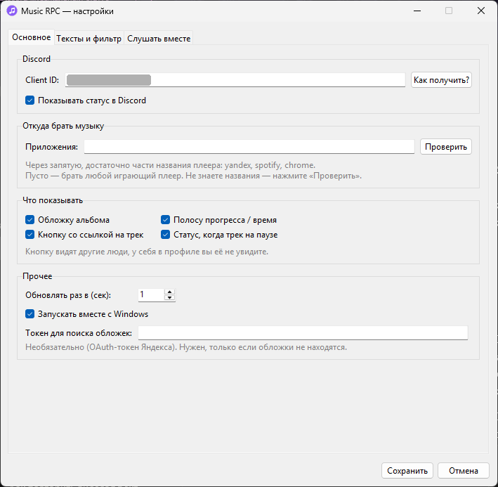
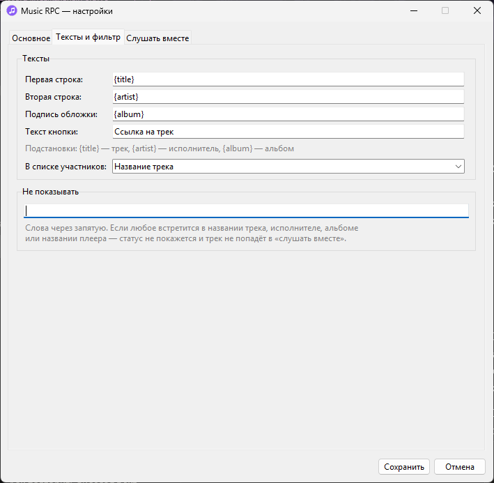
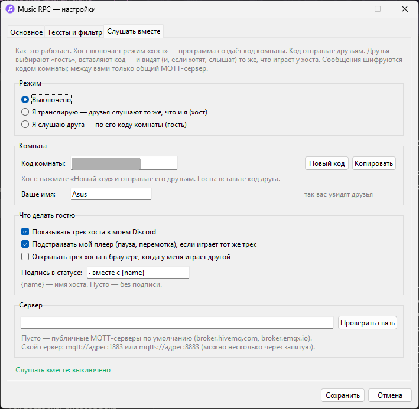

<p align="left">
  
</p>

# Music RPC

[English](README.en.md)

Небольшая программа для Windows. Сидит в трее и показывает в профиле Discord, что вы слушаете: трек, исполнителя, обложку и полоску времени.

Трек берётся из системного медиа-центра Windows, того самого блока, который появляется при нажатии кнопок громкости. Поэтому подходит Яндекс Музыка, Spotify, VK Музыка, браузер и вообще любой плеер, который туда попадает. Входить в аккаунты не нужно.

<p align="center">
  
  &nbsp;&nbsp;&nbsp;
  
</p>

Есть ещё режим «слушать вместе»: друг включает трансляцию, вы вводите его код и видите в своём Discord то, что играет у него. Если у вас открыт тот же трек, плеер повторяет паузу и перемотку. Про это ниже.

## Что нужно

Windows 10 (версия 1809 и новее) или Windows 11. На macOS и Linux программа не заработает, она опирается на медиа-центр и реестр Windows.

Discord должен быть обычным приложением. Во вкладке браузера статус не появится.

Python ставить не обязательно. `install.bat` возьмёт подходящий из уже установленных (3.10–3.14 с tkinter, лучше 3.13). Если такого нет, он сам скачает Python 3.13 в папку `.tools` (около 50 МБ), системный при этом не трогается. Для скачивания нужен доступ к GitHub. Если запускаете из исходников вручную, нужен Python 3.9 или новее.

Интернет нужен только для обложек и для «слушать вместе».

## Установка

Сначала нужно создать приложение в Discord. Так устроен Rich Presence: статус всегда показывается от имени какого-нибудь приложения.

1. Откройте <https://discord.com/developers/applications> и нажмите New Application.
2. Придумайте название. Друзья увидят его в статусе: «Слушает *название*».
3. Если хотите, загрузите иконку в разделе General Information. Готовая лежит в `assets/app.png`.
4. Скопируйте ID приложения (Application ID), это число из 17-20 цифр. Публичный ключ не нужен.

Теперь сама программа.

1. Скачайте репозиторий (Code, потом Download ZIP) и распакуйте в постоянную папку, например `C:\Programs\MusicRPC`. Если включите автозапуск, папку лучше потом не переносить.
2. Запустите `install.bat`. Он один раз создаст окружение `.venv` и поставит зависимости.
3. Запустите `start.bat`. Иконка появится в трее, возможно, среди скрытых значков рядом с часами.
4. При первом запуске откроется окно настроек. Вставьте ID приложения и нажмите «Сохранить».

В самом Discord должен быть разрешён показ вашей активности (раздел про конфиденциальность активности, название пункта зависит от версии).

Включите трек. Через пару секунд статус появится в профиле. Если этого не случилось, запустите `diagnose.bat` (про него ниже).

### Обновление

Закройте программу (правый клик по иконке, Выход), замените файлы новыми и запустите `install.bat` ещё раз, чтобы он доставил недостающие пакеты. Папки `.venv` и `.tools` трогать не нужно. Потом `start.bat`. Настройки сохранятся.

### Из командной строки

```bat
git clone <URL с кнопки Code>
cd MusicRPC

py -3 -m venv .venv
.venv\Scripts\python.exe -m pip install -r requirements.txt

:: без окна консоли
start "" .venv\Scripts\pythonw.exe music_rpc.pyw

:: с консолью и подробным логом
.venv\Scripts\python.exe music_rpc.pyw --debug
```

Флаги запуска: `--diagnose` делает то же, что `diagnose.bat`, `--debug` включает подробный лог, а `--autostart` служебный, его добавляет запись автозапуска.

## Как пользоваться

Цвет иконки в трее показывает состояние: фиолетовая, когда что-то играет, приглушённая на паузе, серая, когда музыки нет или программа выключена, красная при проблеме (наведите курсор, причина написана в подсказке).

По правому клику открывается меню. Сверху состояние, ниже переключатели: показывать ли статус, обложку, полоску прогресса, кнопку со ссылкой и статус на паузе. В подменю «Треки» можно открыть текущий трек в браузере, скопировать ссылку на него и посмотреть десять последних треков (клик по треку открывает его или, если ссылки нет, копирует название). Список хранится только в памяти. Про подменю «Слушать вместе» написано ниже. Двойной клик по иконке открывает настройки.

## Настройки

<p align="center">
  
  
  
</p>

Всё лежит в `%APPDATA%\MusicRPC\config.json`, но проще менять через окно. Если правите файл вручную, сначала закройте программу, иначе она перезапишет его своими значениями.

| Параметр | По умолчанию | Что это |
|---|---|---|
| `client_id` | пусто | ID приложения из Discord |
| `enabled` | `true` | общий выключатель статуса |
| `app_filters` | `["yandex", "яндекс"]` | из каких плееров брать музыку, см. ниже. Пустой список значит «из любого играющего» |
| `show_cover` | `true` | обложка |
| `show_progress` | `true` | полоска прогресса |
| `show_button` | `true` | кнопка со ссылкой на трек |
| `show_paused` | `false` | показывать статус на паузе. Если выключено, на паузе он пропадает |
| `button_label` | `"Открыть трек"` | подпись кнопки, до 32 символов |
| `details_format` | `"{title}"` | первая строка |
| `state_format` | `"{artist}"` | вторая строка |
| `large_text_format` | `"{album}"` | подсказка при наведении на обложку |
| `status_display` | `"name"` | что писать в списке участников сервера: `name` (название приложения), `details` (первая строка) или `state` (вторая) |
| `hide_keywords` | `[]` | слова для фильтра «не показывать» |
| `poll_interval` | `2.0` | как часто опрашивать плеер, от 1 до 10 секунд |
| `autostart` | `false` | запускать вместе с Windows |
| `yandex_token` | пусто | необязательный OAuth-токен Яндекса на случай, если обложки не находятся |
| `together_*` | | настройки «слушать вместе», см. ниже |

Токен хранится в файле открытым текстом, так что не выкладывайте `config.json` никуда.

### Шаблоны строк

В трёх строках работают подстановки `{title}` (трек), `{artist}` (исполнитель) и `{album}` (альбом). Например, `{artist} — {title}`.

Если какого-то значения нет, лишние разделители по краям убираются: `{artist} — {title}` без исполнителя даст просто название. Неизвестная подстановка остаётся как есть, так проще заметить опечатку. Discord принимает строки от 2 до 128 символов, поэтому слишком длинные обрезаются, а односимвольные дополняются невидимым знаком. На паузе (если показ на паузе включён) перед второй строкой ставится ⏸.

### Откуда брать музыку

Windows знает каждый плеер под системным идентификатором. В поле «Приложения» достаточно вписать его кусок, регистр не важен: `yandex`, `spotify`, `chrome`. Несколько плееров через запятую.

Если не знаете, как называется ваш плеер, включите в нём трек и нажмите «Проверить» рядом с полем (или запустите `diagnose.bat`). В списке того, что видит Windows, будет и идентификатор вашего плеера.

Если играет несколько источников, выбирается тот, что играет, и предпочтение отдаётся «текущему» по мнению Windows. Браузеры сообщают Windows о любом воспроизведении, поэтому если добавить браузер, в статус может попасть не только музыка, но и видео.

### Не показывать

На вкладке «Тексты и фильтр» есть поле «Не показывать». Впишите слова через запятую: если любое из них встретится в названии трека, исполнителе, альбоме или названии плеера, статус не покажется, а трек не уйдёт и в «слушать вместе». Иконка при этом станет серой с подсказкой «Скрыто вашим фильтром».

## Слушать вместе

Один человек (хост) транслирует, что слушает, остальные (гости) слушают то же самое. Отдельных аккаунтов и своих серверов не нужно: участники обмениваются короткими зашифрованными сообщениями через общий MQTT-сервер.

Сразу оговорюсь, что синхронизируется состояние, а не звук. У каждого играет его собственный плеер и его собственная подписка. Программа не умеет запустить нужный трек в чужом плеере. Зато она может открыть ссылку на него в браузере, а когда у обоих играет один и тот же трек, повторять паузу и перемотку хоста.

### Как включить

Хост: в трее «Слушать вместе», потом «Я транслирую (хост)». Программа создаст код комнаты вроде `ABCD-EFGH-JKLM` и скопирует его в буфер обмена. Код нужно отправить друзьям.

Гость: в трее «Слушать вместе», потом «Я слушаю друга (гость)…», либо вкладка «Слушать вместе» в настройках. Вставить код, выбрать режим «гость», сохранить.

Пока хост слушает музыку, гости видят его трек. У хоста в меню написано, сколько человек слушает и как их зовут. Чтобы выйти, выберите «Выключено». Хосту не нужны ни Discord, ни Client ID, трансляция работает и без них.

### Что делает гость

По умолчанию включены две вещи. Во-первых, в вашем Discord показывается трек хоста (обложка, время, кнопка) с подписью «· вместе с *имя*». Это работает, даже если у вас самих ничего не играет. Во-вторых, если у вас открыт тот же трек, плеер повторяет паузу и плей хоста, а при расхождении больше чем на три секунды перематывается.

Если вы сами поставили паузу, программа не будет с этим спорить, пока хост что-нибудь не переключит. Не все плееры разрешают внешнее управление. Если ваш отказывается (чаще всего не умеет перематывать), программа перестаёт пробовать до смены трека.

Третья настройка выключена: открывать трек хоста в браузере, когда у вас играет другой. Открывается страница трека в Яндекс Музыке, по одному разу на трек. Вручную то же самое делает пункт меню «Открыть трек хоста».

### Как проверить, что работает

Без друга и даже без Discord. Откройте настройки, вкладка «Слушать вместе», кнопка «Проверить связь» (до 30 секунд). Программа поднимет у вас на компьютере хоста и гостя в случайной комнате и передаст тестовый трек через настоящий сервер. Заодно проверятся шифрование и то, что гость, зашедший позже, получает текущий трек. То же самое делает третий раздел `diagnose.bat`.

Это проверка связи. Как поведёт себя конкретный плеер при паузе и перемотке, видно только в живой проверке вдвоём.

### Как это защищено

Из кода комнаты получаются (PBKDF2-HMAC-SHA256, 100 000 итераций) имя канала на сервере и ключи. В коде 12 символов из 32, то есть 60 бит, перебором такое не найти. Сообщения шифруются и подписываются (HMAC-SHA256 в режиме счётчика плюс подпись HMAC-SHA256). Сервер видит только шифртекст и ваш IP.

Это защита от случайных зевак на публичном сервере. Если нужно что-то по-настоящему секретное, это не замена проверенной криптографии. Знающий код находится в комнате, так что отправляйте его только друзьям, а сменить «замок» можно кнопкой «Новый код». Ссылки, пришедшие от хоста, принимаются только с сайтов Яндекса. Всё остальное отбрасывается.

### Серверы

По умолчанию используются публичные брокеры `broker.hivemq.com` и `broker.emqx.io` (порт 1883). Если один недоступен, программа переключается на другой. Они бесплатные и без гарантий. Если их блокирует провайдер или хочется независимости, поднимите свой (подойдёт любой MQTT 3.1.1, например Mosquitto) и впишите адрес на вкладке «Слушать вместе»: `mqtt://адрес:1883` или `mqtts://адрес:8883`. У всех участников адрес должен быть одинаковым.

### Параметры

| Параметр | По умолчанию | Что это |
|---|---|---|
| `together_mode` | `"off"` | `off`, `host` или `guest` |
| `together_room` | пусто | код комнаты |
| `together_name` | пусто | как вас видят друзья (иначе «Хост» или «Гость») |
| `together_broker` | пусто | адрес сервера, пусто значит «публичные», можно несколько через запятую |
| `together_mirror` | `true` | гость: показывать трек хоста в своём Discord |
| `together_sync_player` | `true` | гость: повторять паузу и перемотку хоста |
| `together_auto_open` | `false` | гость: открывать трек хоста в браузере |
| `together_suffix` | `"· вместе с {name}"` | подпись во второй строке статуса гостя |

## Автозапуск

Включается галочкой в настройках или пунктом меню в трее. Программа записывает себя в `HKEY_CURRENT_USER\Software\Microsoft\Windows\CurrentVersion\Run` (права администратора не нужны) с флагом `--autostart`. Получив его, она ждёт, пока появится панель задач (до 90 секунд), и ещё пять секунд, чтобы поднялись Discord и сеть. Пока Discord запускается, она сама пытается подключиться, так что статус появляется через 10-20 секунд после входа в Windows.

Если после перезагрузки статуса нет:

1. Откройте диспетчер задач (Ctrl+Shift+Esc), вкладка «Автозагрузка». Запись должна быть включена.
2. Загляните в `%APPDATA%\MusicRPC\app.log`. Строка «Запуск при входе в Windows» с временем загрузки значит, что программа стартовала. Если её нет, посмотрите `crash.log` рядом.
3. Не переносите папку с программой. Если всё же перенесли, запустите её один раз вручную, путь в реестре обновится.

## Сборка в .exe

Это необязательно. Запустите `install.bat`, потом `build_exe.bat`, и в `dist` появится `MusicRPC.exe` с иконкой из `assets/app.ico`. Python рядом ему не нужен. Автозапуск из `.exe` работает так же. Если у файла осталась старая иконка, это кэш значков Windows: переименуйте файл или перезапустите Проводник.

## Как это устроено

Плеер сообщает Windows название, исполнителя, альбом, позицию и состояние. Программа читает всё это через `GlobalSystemMediaTransportControlsSessionManager` (пакеты `winrt-*`), отбирает сессии по фильтру `app_filters` и берёт играющую. Позиция пересчитывается: Windows запоминает её на момент `last_updated_time`, и программа добавляет время, прошедшее с тех пор. Если плеер не отдаёт ни позицию, ни длительность, время считается по собственным часам с учётом пауз, и в Discord показывается счётчик вместо полоски.

Discord умеет показывать картинку только по ссылке, а Windows отдаёт обложку как поток данных. Поэтому обложку ищут по названию и исполнителю: сначала в Яндекс Музыке (заодно получается ссылка на трек), потом в Deezer, потом в iTunes. Найденное сверяется по названию и исполнителю, смотрятся первые шесть результатов. Поиск идёт в отдельном потоке, первый показ трека ждёт обложку не дольше 4 секунд, результаты кэшируются. Используется только стандартная библиотека Python.

Со статусом всё идёт через локальный канал Discord (`discord-ipc-N`), библиотека `pypresence`. Обновление отправляется при смене трека, паузе, перемотке (позиция «уехала» больше чем на 4 секунды, но не чаще раза в 15 секунд) и не чаще раза в 2 секунды. Лимиты у Discord строгие, поэтому лишнего не шлётся. Если Discord отклонил статус целиком, уходит упрощённый вариант без картинок и кнопок. Когда трек на мгновение пропадает (плеер при смене трека теряет название), статус не убирается сразу, а ждёт 4 секунды.

Подключение к Discord осторожное. Программа перебирает каналы с 0 по 9 и ждёт ответа не дольше 8 секунд, потому что сразу после старта Windows Discord создаёт канал раньше, чем начинает на нём отвечать, а библиотека в таком случае ждёт вечно. Нет связи, значит повтор каждые 10 секунд. Неверный Client ID проверяется заново через 30 секунд, а если вы исправили его в настройках, то сразу.

В «слушать вместе» используются два топика на MQTT-сервере: в один пишет хост (сообщение сохраняется на сервере, поэтому вошедший позже гость видит трек сразу), в другой пишут гости. Хост шлёт состояние при изменениях и раз в 10 секунд, гость сообщает о себе раз в 20. Состояние старше 35 секунд считается устаревшим. Если у хоста пропал интернет, сервер сам оповещает гостей (MQTT last will). Сообщения с временем, отличающимся от местного больше чем на 10 минут, отбрасываются. Позиция хоста пересчитывается у гостя локально, поэтому полоска идёт плавно.

Три потока: главный (tkinter, окно настроек), трей (`pystray`) и рабочий (`asyncio`, весь опрос и общение с Discord). Второй экземпляр запустить нельзя, программа занимает мьютекс `Local\MusicRPC_singleton`.

## Файлы

```
music_rpc.pyw          точка входа, без консоли; при сбое пишет crash.log
install.bat            окружение и зависимости
start.bat              запуск без консоли
diagnose.bat           диагностика
build_exe.bat          сборка MusicRPC.exe
requirements.txt
assets/                иконка (app.png, app.ico)
docs/                  скриншоты
tests/                 автотесты
ymrpc/
  app.py               запуск, логи, --diagnose
  config.py            настройки и папка данных
  media.py             чтение медиа-центра Windows, управление плеером
  covers.py            поиск обложек и ссылок
  textmatch.py         сравнение названий
  rpc.py               сборка статуса и рабочий цикл
  together.py          «слушать вместе»
  history.py           недавние треки
  status.py            состояния и цвета иконки
  tray.py              иконка и меню
  ui.py                окно настроек
  icon.py              иконка (рисуется кодом)
  autostart.py         автозапуск
```

Название в трее и окнах меняется в одной строке: `DISPLAY_NAME` в `ymrpc/__init__.py`. Иконку рисует `ymrpc/icon.py`, а `python -m ymrpc.icon` пересоздаёт файлы в `assets`.

## Данные и приватность

Всё лежит в `%APPDATA%\MusicRPC`: `config.json`, `app.log` (до 512 КБ, две старые копии) и `crash.log`, если программа не смогла запуститься. Настройки от прежних версий (`%APPDATA%\YandexMusicRPC`) подхватываются сами.

В Discord уходит то, что вы видите в статусе. В Яндекс Музыку, Deezer и iTunes уходит поисковый запрос «исполнитель название», и только ради обложки: если выключить и обложку, и кнопку, запросов не будет. Исключение: хост в режиме «слушать вместе» всё равно ищет обложку и ссылку, чтобы передать их гостям. Когда «слушать вместе» включено, на MQTT-сервер уходят ещё зашифрованные сообщения и виден ваш IP. Ни аналитики, ни телеметрии, ни учётных записей нет.

## Если что-то не работает

Сначала закройте программу в трее и запустите `diagnose.bat`. Он покажет, какие плееры видит Windows, проверит связь с Discord (отправит тестовый статус на 6 секунд) и проверит серверы для «слушать вместе».

- Красная иконка «Укажите Client ID»: не заполнено поле в настройках.
- «Неверный Client ID»: Discord не знает такого приложения. Скопируйте именно ID приложения, а не публичный ключ.
- «Discord не найден»: он не запущен, открыт во вкладке браузера или запущен с другими правами (например, только один из двух от имени администратора). Перезапустите оба от обычного пользователя.
- «Discord не отвечает»: в первые секунды после запуска Windows это нормально, программа переподключится сама. Если не проходит, помогает полный перезапуск Discord. Подробности в `app.log`.
- Серая иконка при играющей музыке: плеер не виден или не подходит под `app_filters`. Нажмите «Проверить» в настройках.
- Плеера нет в списке совсем: он не сообщает Windows о воспроизведении. В Яндекс Музыке, например, помогает отключить плавный переход между треками.
- Статус есть, обложки нет: трек не нашёлся в каталогах или нет сети. Для редких треков это нормально.
- Кнопки не видно в своём профиле: так устроен Discord, кнопки видят только другие.
- Полоска прогресса прыгает: плеер плохо сообщает позицию. Отключите полоску.
- В статусе видео с YouTube: в `app_filters` добавлен браузер.
- «Слушать вместе: нет связи с сервером»: публичные серверы недоступны (порт 1883 может быть закрыт провайдером или файрволом). Посмотрите `diagnose.bat`, попробуйте VPN или укажите свой сервер.
- «Слушать вместе: жду хоста…»: хост не запущен, у него ничего не играет, код введён неверно или часы на компьютерах расходятся больше чем на 10 минут.
- Плеер гостя не реагирует: управление работает, только если у вас играет тот же трек (сравниваются название и исполнитель). Откройте трек по ссылке хоста. Перемотку принимают не все плееры, в `app.log` при отказе появится запись.

Если ничего не помогло, пришлите последние 30 строк `app.log` и вывод `diagnose.bat`.

## Автотесты

В папке `tests` около девяноста тестов. Windows, Discord и интернет для них не нужны: медиа-центр, Discord и MQTT-сервер подменяются заглушками.

```bat
.venv\Scripts\python.exe -m unittest discover -s tests -t .
```

Дополнительно запускаются тесты с настоящей библиотекой `pypresence` против поддельного Discord (только не на Windows), с настоящим Mosquitto (если он есть в `PATH`) и тесты окна и меню в трее (нужен дисплей, на Linux подойдёт `xvfb-run`). Набор проходит на Python 3.9-3.14 и 3.15 alpha, с `paho-mqtt` 1.x и 2.x.

## Благодарности и оговорка

Спасибо авторам [pypresence](https://github.com/qwertyquerty/pypresence), [pystray](https://github.com/moses-palmer/pystray), [pywinrt](https://github.com/pywinrt/pywinrt), [paho-mqtt](https://github.com/eclipse-paho/paho.mqtt.python) и [Pillow](https://python-pillow.org/).

Проект неофициальный и не связан с Discord, Яндексом, Spotify, Deezer, Apple, HiveMQ и EMQ. Все названия принадлежат их владельцам и упоминаются только для описания совместимости.

## Лицензия

[MIT](LICENSE).
